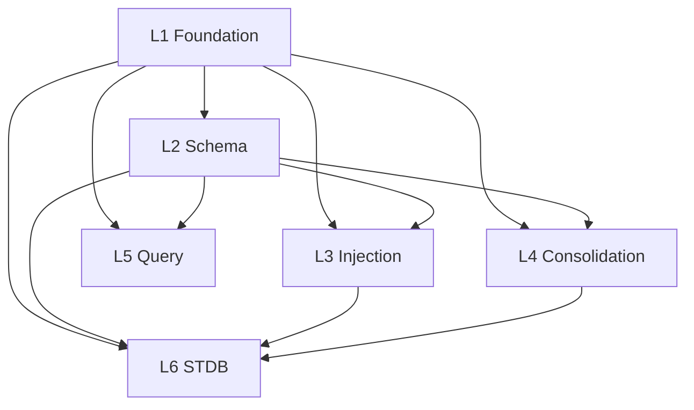

> Back to: [[HOME]] · [[MASTER INDEX]]

# Architecture Overview

## 6-Layer Design

```
L1 Foundation        (m01-m05)  — types, errors, config, traits, constants
L2 Schema            (m06-m10b) — SQLite tables, CRUD, migrations
L3 Injection Engine  (m11-m14)  — parallel query, renderer, fallback, consent
L4 Consolidation     (m15-m18)  — checkpoint ingest, Hebbian, cache, atuin
L5 Query & Browser   (m19-m21b) — presets, raw SQL, fzf, scripts
L6 STDB Migration    (m22-m24)  — Phase 2 SpaceTimeDB module + ingester
```

## Dependency Rules

- L1 has zero upward imports
- L2 depends only on L1
- L3 and L4 depend on L1 + L2 (parallel, independent of each other)
- L5 depends on L1 + L2
- L6 depends on L1 + L2 + L3 + L4



## Design Principles

1. **Bottom-up implementation** — L1 first, each layer only uses layers below it
2. **Consent-first** — every table carries ConsentLevel (Emit/Store/Forget), only Emit data enters injection
3. **Hebbian learning** — patterns that fire get reinforced, patterns that don't decay and get pruned
4. **Three-tier fallback** — SQLite -> atuin KV -> static, never fails
5. **<100ms injection** — hard latency budget, parallel queries, cached payload
6. **<2KB payload** — token-counted prose, 5 sections with per-section budgets
7. **Feature-gated phases** — Phase 2 (STDB) behind feature flags, Phase 1 ships with `default = ["sqlite", "cli"]`

## SQLite Tables (Phase 1)

| Table | Purpose | Key Column |
|-------|---------|-----------|
| `causal_chain` | Why things happened, bug/trap tracking | `reinforcement_count` |
| `session_trajectory` | Fitness deltas across sessions | `delta_summary` |
| `workstream` | In-flight/blocked/deferred work | `status`, `blocker` |
| `reinforced_pattern` | Hebbian-weighted patterns | `weight` (0.0-1.0) |
| `injection_cache` | Pre-rendered injection payload | `computed_at` |
| `session_checkpoint` | /save-session structured records | `session_id` |

## Two Timescales

- **Injection** (SessionStart, <100ms): read injection_cache or rebuild from tables, apply consent filter, render prose, inject into context window
- **Consolidation** (post-session): harvest /save-session checkpoint, capture trajectory, decay/reinforce patterns, rebuild cache, sync atuin KV
