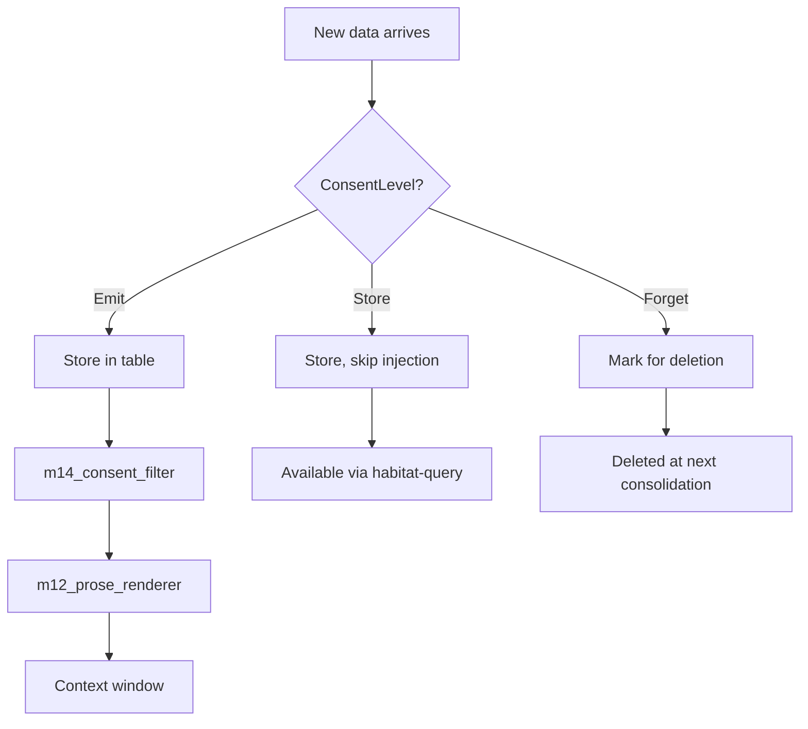

> Back to: [[HOME]] · [[MASTER INDEX]] · [[Architecture Overview]]

# Consent Model

## Three Levels

| Level | Meaning | Injection | Storage | Deletion |
|-------|---------|-----------|---------|----------|
| **Emit** | Data may be injected into context window | Yes | Yes | On request |
| **Store** | Data kept for queries but not injected | No | Yes | On request |
| **Forget** | Data marked for deletion at next consolidation | No | Pending delete | Automatic |

## Implementation

Every table carries a `consent TEXT NOT NULL DEFAULT 'Emit'` column. The consent filter (`m14_consent_filter`) runs before the prose renderer and drops all non-Emit rows.

## Consent Flow

## Design Decision

Consent is per-row, not per-table or per-session. This allows fine-grained control: a workstream can be `Emit` (injected) while its blocker details are `Store` (queryable but not auto-injected).
