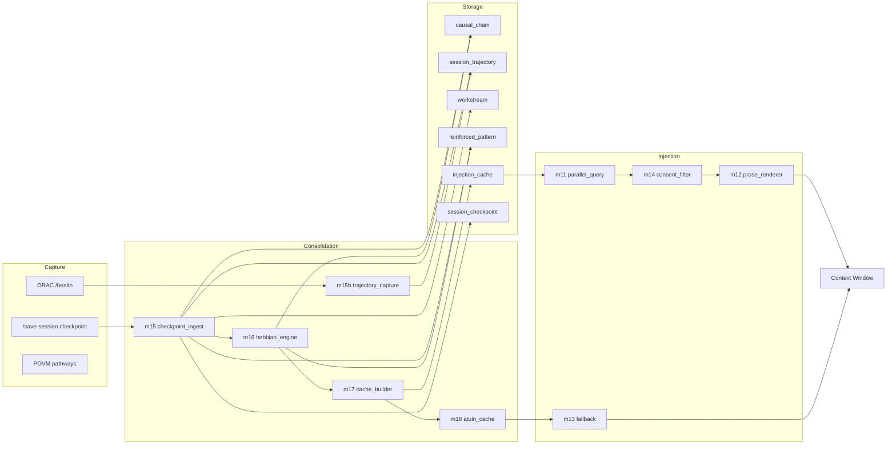

> Back to: [[HOME]] · [[MASTER INDEX]] · [[Architecture Overview]]

# Data Flow

## Overview

Memory flows through three stages: **capture** (services -> consolidation), **storage** (SQLite tables), and **injection** (tables -> context window).

## Write Path (Consolidation)

1. /save-session writes checkpoint to `~/projects/shared-context/sessions/*.md`
2. `m15_checkpoint_ingest` parses YAML frontmatter + markdown sections
3. Harvests into 5 tables (checkpoint, trajectory, workstream, causal_chain, pattern)
4. `m16_hebbian_engine` decays unfired patterns, reinforces fired ones, prunes weak
5. `m17_cache_builder` rebuilds `injection_cache` from fresh data
6. `m18_atuin_cache` writes to atuin KV for fallback

## Read Path (Injection)

1. SessionStart hook fires `habitat-inject`
2. `m11_parallel_query` runs 4 SQLite queries concurrently
3. `m14_consent_filter` drops non-Emit rows
4. `m12_prose_renderer` renders <2KB prose payload
5. If SQLite fails: `m13_fallback` tries atuin KV, then static
6. Payload injected into context window system message
