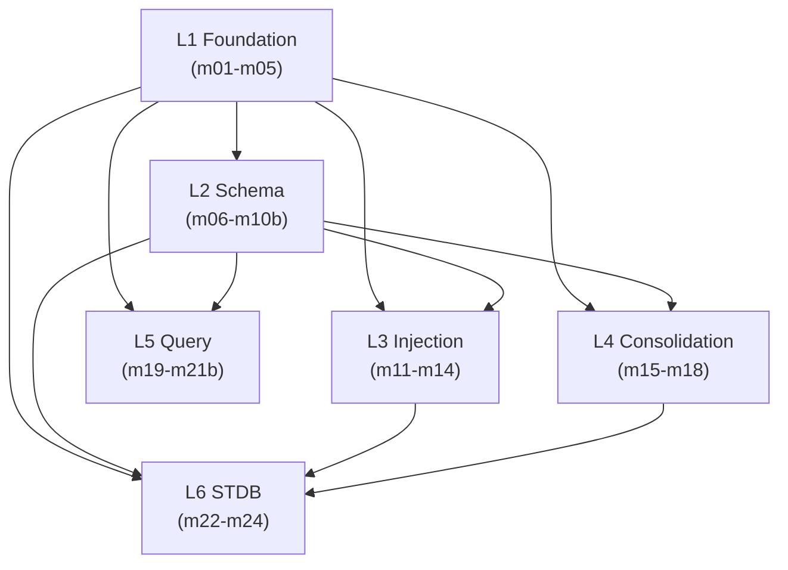

> Back to: [[HOME]] · [[MASTER INDEX]] · [[Architecture Overview]]

# Dependency Graph

## Layer Dependencies



## Implementation Order

```
L1 (no deps)           ← start here
 └── L2 (needs L1)
      ├── L3 (needs L1, L2)    ← these three are
      ├── L4 (needs L1, L2)    ← independent of
      ├── L5 (needs L1, L2)    ← each other
      └── L6 (needs L1, L2, L3, L4)  ← last
```

## Rules

- No upward imports (L2 cannot import L3)
- No lateral imports between L3/L4/L5 (they share L2 but don't know about each other)
- L6 is the only layer that depends on L3 and L4
- Feature-gated modules (L6) never imported by non-gated code
