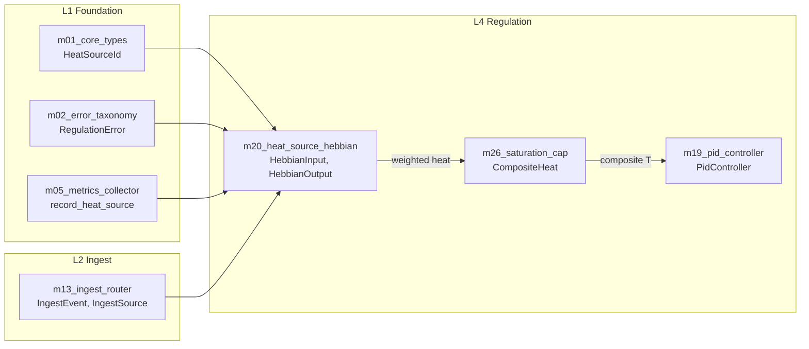

> Back to: [[HOME]] · [[MASTER INDEX]] · [[Module Index]]

# Gold Standard Exemplars

> Drawn from **SYNTHEX v2** (60 modules, 2837 tests, 8 layers) and **DevOps Engine V3** (40 modules, 1851 tests, 8 layers) — the two gold standard codebases in the Habitat. These exemplars encode the patterns that `habitat-injection` must follow for every module.

---

## 1. The Shape of a Gold Standard Module

Every module in both codebases follows the same skeleton:

```rust
//! `m{NN}_{name}` — One sentence saying what this module produces.
//!
//! Extended explanation of the module's role, its inputs, its outputs,
//! and the invariant it maintains. Tables for parameters. Dependency
//! list with fully-qualified crate paths. Layer declaration.
//!
//! ## Layer
//!
//! `m{N}_{layer_name}`
//!
//! ## Dependencies
//!
//! - [`crate::m1_foundation::m01_core_types`] — which types imported
//! - [`crate::m1_foundation::m02_error_taxonomy`] — which errors
//!
//! ## Invariants
//!
//! - Output is always in `[min, max]`.
//! - No `unsafe`. All fallible fns return `Result<T, E>`.
//! - 50+ tests in `#[cfg(test)] mod tests`.

#![allow(clippy::module_name_repetitions)]

use serde::{Deserialize, Serialize};
use crate::m1_foundation::m01_core_types::{ExactType, AnotherType};
use crate::m1_foundation::m02_error_taxonomy::SpecificError;

// ---------------------------------------------------------------------------
// Types (input/output structs)
// ---------------------------------------------------------------------------

/// Input struct — validated at construction, trusted downstream.
#[derive(Debug, Clone, PartialEq, Serialize, Deserialize)]
pub struct ModuleInput { /* ... */ }

impl ModuleInput {
    /// Fallible constructor — validates all fields.
    ///
    /// # Errors
    ///
    /// Returns [`SpecificError::Variant`] if validation fails.
    pub fn new(/* params */) -> Result<Self, SpecificError> { /* ... */ }
}

/// Output struct — `#[must_use]` when it carries a result the caller
/// must act on.
#[must_use]
#[derive(Debug, Clone, PartialEq)]
pub struct ModuleOutput { /* ... */ }

// ---------------------------------------------------------------------------
// Core logic (the module's contribution)
// ---------------------------------------------------------------------------

/// The primary struct that owns state and computes results.
pub struct ModuleName { /* config + state */ }

impl ModuleName {
    /// Construct with validated config.
    pub fn new(config: Config) -> Result<Self, SpecificError> { /* ... */ }

    /// The primary computation. Pure function where possible.
    pub fn compute(&self, input: &ModuleInput) -> Result<ModuleOutput, SpecificError> {
        // ...
    }
}

// ---------------------------------------------------------------------------
// Tests (50+ minimum, in-file)
// ---------------------------------------------------------------------------

#[cfg(test)]
mod tests {
    use super::*;
    // 50+ tests covering: construction, validation, happy path,
    // edge cases, error paths, property tests where applicable
}
```

### Key structural rules

| Rule | Enforcement |
|------|------------|
| Module doc comment declares layer, deps, invariants | Convention |
| Explicit imports, never glob | `use crate::m1_foundation::m01_core_types::ExactType` |
| Types validated at construction, trusted downstream | Constructor returns `Result` |
| `#[must_use]` on output types carrying decisions | Compile-time enforcement |
| `#[non_exhaustive]` on public enums | Additive-only API evolution |
| Section separators (`// -------`) for visual blocks | Convention (Types / Logic / Tests) |
| All public items have doc comments with backticks | clippy `doc_markdown` |
| `#[cfg(test)] mod tests` at bottom of same file | Convention |
| 50+ tests per module | Tracked in [[Implementation Status]] |

---

## 2. Exemplar A — Foundation Type Module

**Source:** `synthex-v2/src/m1_foundation/m01_core_types.rs` (1444 LOC, 70 tests)

This is the canonical "bounded newtype" pattern. Every typed concept that crosses a module boundary gets a newtype here. Raw `String`/`u64`/`f64` at module boundaries is banned.

### Pattern: Bounded Newtype with Validated Constructor

```rust
/// Nanosecond-precision wall-clock timestamp since UNIX epoch.
#[derive(Debug, Clone, Copy, PartialEq, Eq, PartialOrd, Ord, Hash,
         Serialize, Deserialize)]
#[serde(transparent)]
pub struct Timestamp(u64);

impl Timestamp {
    #[must_use]
    pub fn now() -> Self {
        let ns = SystemTime::now()
            .duration_since(UNIX_EPOCH)
            .map_or(0, |d| {
                let nanos = d.as_nanos();
                if nanos > u128::from(u64::MAX) { u64::MAX }
                else {
                    #[allow(clippy::cast_possible_truncation)]
                    { nanos as u64 }
                }
            });
        Self(ns)
    }

    #[must_use]
    pub const fn from_nanos(ns: u64) -> Self { Self(ns) }

    #[must_use]
    pub const fn as_nanos(self) -> u64 { self.0 }

    #[must_use]
    pub const fn saturating_add(self, d: DurationNs) -> Self {
        Self(self.0.saturating_add(d.0))
    }

    #[must_use]
    pub const fn saturating_sub(self, earlier: Self) -> DurationNs {
        DurationNs(self.0.saturating_sub(earlier.0))
    }
}
```

### Why this is gold standard

1. **`#[serde(transparent)]`** — serialises as bare `u64`, zero overhead
2. **`const fn`** everywhere possible — compile-time evaluation
3. **`#[must_use]`** on every accessor — caller can't ignore the result
4. **Saturating arithmetic** — no panic on overflow, no `unwrap`
5. **`#[allow(clippy::cast_possible_truncation)]`** with an inline comment explaining the bound check immediately above — the only place `allow` is justified
6. **Zero `unsafe`** — the fallback `map_or(0, ...)` handles the impossible case (clock before epoch) without panicking

### How habitat-injection applies this

`m01_types.rs` must define `SessionId`, `ChainId`, `PatternWeight`, `ConsentLevel`, `TokenBudget` using this exact pattern:
- Validated at construction
- `const fn` accessors
- `#[must_use]` on all returns
- `PatternWeight` clamps to `[0.0, 1.0]` via constructor, never re-validated downstream

---

## 3. Exemplar B — Cross-Module Interaction (Regulation -> Foundation)

**Source:** `synthex-v2/src/m4_regulation/m20_heat_source_hebbian.rs` (53 tests)

This exemplar shows how a higher layer (L4 Regulation) consumes types from both L1 Foundation and L2 Ingest — the canonical cross-module data flow.

### Pattern: Input Validated Once, Trusted Everywhere

```rust
use crate::m1_foundation::m01_core_types::HeatSourceId;
use crate::m1_foundation::m02_error_taxonomy::RegulationError;
use crate::m1_foundation::m05_metrics_collector::record_heat_source;
use crate::m2_ingest::m13_ingest_router::{IngestEvent, IngestSource};

/// A snapshot of the PV2 Kuramoto field consumed by HS-001.
///
/// All fields are validated at construction; downstream math trusts
/// the bounds (`r ∈ [0, 1]`, `k_mod` finite).
#[derive(Debug, Clone, Copy, PartialEq, Serialize, Deserialize)]
pub struct HebbianInput {
    pub r: f64,
    pub k_mod: f64,
    pub spheres: u32,
}

impl HebbianInput {
    pub fn new(r: f64, k_mod: f64, spheres: u32)
        -> Result<Self, RegulationError>
    {
        if !r.is_finite() || !k_mod.is_finite() {
            return Err(RegulationError::NonFiniteHeat {
                id: HeatSourceId::Hebbian.code(),
            });
        }
        if !(0.0..=1.0).contains(&r) {
            return Err(RegulationError::NonFiniteHeat {
                id: HeatSourceId::Hebbian.code(),
            });
        }
        Ok(Self { r, k_mod, spheres })
    }

    /// Best-effort extraction from a PV2 ingest event.
    /// Returns `None` for malformed inputs — fire-and-forget
    /// ingest path must not stall the controller loop.
    #[must_use]
    pub fn from_pv2_payload(event: &IngestEvent) -> Option<Self> {
        if event.source != IngestSource::Http { return None; }
        let r = event.payload.get("r")
            .and_then(serde_json::Value::as_f64)?;
        let k_mod = event.payload.get("k_mod")
            .and_then(serde_json::Value::as_f64)?;
        let spheres = event.payload.get("spheres")
            .and_then(serde_json::Value::as_u64)?;
        let spheres = u32::try_from(spheres).ok()?;
        Self::new(r, k_mod, spheres).ok()
    }
}
```

### Cross-module flow diagram



### Why this is gold standard

1. **Two constructors** — `new()` (strict, for internal use) and `from_pv2_payload()` (lenient, for ingest) solve different trust levels with the same type
2. **`Option` not `Result` for ingest** — the fire-and-forget path returns `None` on bad data, never stalls the controller. The doc comment explains *why* this is intentional
3. **Layer imports are explicit and one-directional** — L4 imports from L1 and L2; L1 never imports from L4
4. **Soft ceiling** — `0.85` cap with smooth asymptote (not hard clamp) preserves gradient information for the PID controller downstream. The doc comment explains the V1 bug this fixes
5. **`record_heat_source`** — metric emission is a side effect in `compute()`, not the caller's responsibility. Metrics are coupled to the computation, not bolted on

### How habitat-injection applies this

`m16_hebbian_engine.rs` (L4) must:
- Import types from L1 (`PatternWeight`, `SessionId`) and L2 (`m07_causal_chain`, `m10_pattern`)
- Validate inputs once at the boundary (pattern weight comes from DB already validated by L2's constructor)
- Return `Result<DecayReport, ConsolidationError>` — never `Option` for internal operations
- Emit metrics via L1's metrics module if added

---

## 4. Exemplar C — Learning/Feedback Module with External Hook

**Source:** `dev-ops-engine-v3/src/m5_learning/m22_hebbian_feedback.rs` (50+ tests, 16 pathways)

This exemplar shows the pattern for a module with external side effects (POVM persistence) that must never block the core algorithm.

### Pattern: Trait-Based Sink with Null Default

```rust
/// Callback trait invoked after each STDP event so external systems
/// (POVM, RM) can record pathway updates without blocking the
/// learning loop.
///
/// Errors inside implementations must not propagate — log and return.
/// The Hebbian loop must never fail because persistence is unavailable.
pub trait PersistenceHook: Send + Sync {
    fn on_pathway_update(&self, pathway_id: &str,
                         new_weight: f64, event_type: &str);
    fn on_ltp(&self, pathway_id: &str, amount: f64, timing_factor: f64);
    fn on_ltd(&self, pathway_id: &str, amount: f64);
}

/// No-op hook — used as default when no persistence target is
/// configured (unit tests and standalone runs).
pub struct NullPersistenceHook;

impl PersistenceHook for NullPersistenceHook {
    fn on_pathway_update(&self, _: &str, _: f64, _: &str) {}
    fn on_ltp(&self, _: &str, _: f64, _: f64) {}
    fn on_ltd(&self, _: &str, _: f64) {}
}

// Constants — named, never magic numbers
pub const LTP_RATE: f64 = 0.1;
pub const LTD_RATE: f64 = 0.05;
pub const DECAY_RATE: f64 = 0.001;
pub const MIN_WEIGHT: f64 = 0.0;
pub const MAX_WEIGHT: f64 = 1.0;
pub const IDLE_GATE_THRESHOLD: u32 = 2;
pub const INITIAL_WEIGHT: f64 = 0.5;
pub const PATHWAY_COUNT: usize = 16;
pub const MAX_EVENTS: usize = 10_000;
```

### Pattern: Gated Learning + Bounded Event Log

```rust
pub struct HebbianFeedback {
    pathways: HashMap<String, PathwayState>,
    event_log: Vec<StdpEvent>,
    persistence: Arc<dyn PersistenceHook>,
    working_tier_count: u32,
}

impl HebbianFeedback {
    pub fn record_tier_result(&mut self, pathway_id: &str,
                              outcome: TierOutcome,
                              timing_ms: u64)
        -> Result<StdpDelta, WorkflowError>
    {
        // GATE: STDP only fires when working_tier_count >= 2
        // (NAM-02 / Session 075 fix — prevents noise from
        // singleton events)
        if self.working_tier_count < IDLE_GATE_THRESHOLD {
            return Ok(StdpDelta::gated());
        }

        let timing_factor = compute_timing_factor(timing_ms);
        let delta = match outcome {
            TierOutcome::Passed => {
                let amount = LTP_RATE * timing_factor;
                self.strengthen(pathway_id, amount)?;
                self.persistence.on_ltp(pathway_id, amount,
                                        timing_factor);
                StdpDelta::ltp(amount)
            }
            TierOutcome::Failed | TierOutcome::Halted
            | TierOutcome::TimedOut => {
                let amount = LTD_RATE * timing_factor;
                self.weaken(pathway_id, amount)?;
                self.persistence.on_ltd(pathway_id, amount);
                StdpDelta::ltd(amount)
            }
            TierOutcome::Escalated => StdpDelta::none(),
        };

        self.persistence.on_pathway_update(
            pathway_id,
            self.pathways[pathway_id].weight,
            delta.event_type(),
        );

        // Bounded event log — evict oldest when full
        if self.event_log.len() >= MAX_EVENTS {
            self.event_log.drain(0..MAX_EVENTS / 10);
        }
        self.event_log.push(StdpEvent::new(pathway_id, delta));

        Ok(delta)
    }

    pub fn tick(&mut self) -> Result<u32, WorkflowError> {
        // Passive decay on ALL pathways — keeps stale ones
        // from dominating
        let mut decayed = 0u32;
        for state in self.pathways.values_mut() {
            state.weight = (state.weight - DECAY_RATE)
                .max(MIN_WEIGHT);
            decayed += 1;
        }
        Ok(decayed)
    }
}
```

### Why this is gold standard

1. **`PersistenceHook` trait** — external persistence is injected, never hard-coded. Tests use `NullPersistenceHook`; production uses `PovmPersistenceHook`. The core algorithm is pure and testable
2. **`Send + Sync` bound** — the hook lives behind `Arc<dyn PersistenceHook>` and works across async task boundaries
3. **"Errors must not propagate"** — the doc comment is an explicit design decision, not a gap. The learning loop is more important than persistence
4. **Idle gating** — STDP only fires when `working_tier_count >= 2`. The comment cites the session where this bug was fixed (S075). This is a comment that earns its existence
5. **Bounded event log** — `MAX_EVENTS` with FIFO eviction prevents unbounded memory growth. The drain takes 10% to amortise the eviction cost
6. **Named constants** — `LTP_RATE`, `LTD_RATE`, `DECAY_RATE` are all `pub const` with doc comments. Zero magic numbers
7. **`TierOutcome` re-exported** — `pub use crate::m7_orchestrator::m32_tier_executor::TierOutcome` so callers import from one place

### How habitat-injection applies this

`m16_hebbian_engine.rs` must:
- Define `pub const DECAY_RATE: f64 = 0.95` etc. in `m05_constants` and import them
- Use a trait for persistence if external sinks are needed (atuin KV, POVM)
- Gate on meaningful activity (don't decay if no session has run)
- Bound any in-memory collections (`MAX_EVENTS` pattern)
- Weight clamping via `PatternWeight` newtype (already validated at L1)

---

## 5. Cross-Module Logic Flow Summary

The three exemplars show the complete flow pattern:

```
L1 defines types + errors + constants (trusted everywhere)
  ↓
L2 persists + retrieves (constructs validated types from DB rows)
  ↓
L3/L4 consumes L1 types + L2 data, produces decisions
  ↓
L5 queries L2 data shaped by L1 types
  ↓
L6 bridges to external (trait-injected sinks, never hard-coded)
```

### The 10 rules that make this flow gold standard

1. **Types validated once at construction** — downstream code trusts invariants
2. **Errors are typed per-layer** — `RegulationError`, `ConsolidationError`, not `String`
3. **Layer imports are one-directional** — higher layers import lower, never reverse
4. **No lateral imports** — L3, L4, L5 don't import each other
5. **External I/O via injected traits** — `PersistenceHook`, `StdbWriter`, `HttpBackend`
6. **Null implementations for tests** — `NullPersistenceHook`, `InMemoryStdbWriter`
7. **`#[must_use]` on decision types** — `BridgeResponse<T>`, `PidOutput`, `StdpDelta`
8. **Comments only when WHY is non-obvious** — the V1 bug fix, the idle gate, the fire-and-forget decision
9. **Named constants, never magic numbers** — `LTP_RATE` not `0.1`
10. **Bounded collections** — `MAX_EVENTS`, `MAX_CHAINS_INJECTED`, drain-and-evict

---

*Gold Standard Exemplars v1.0 | 2026-04-24 | Drawn from SYNTHEX v2 (60 modules) and DevOps V3 (40 modules) | Apply these patterns to every habitat-injection module*
