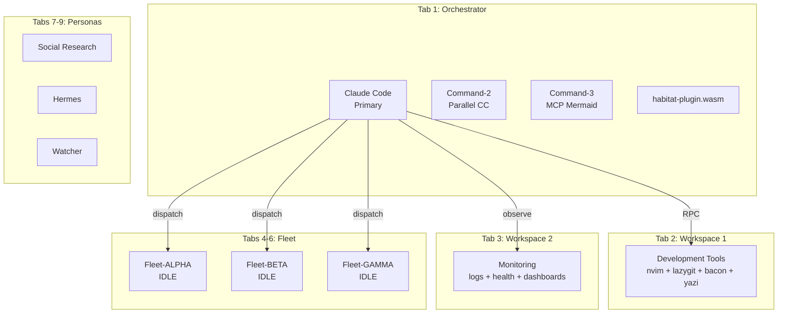

> Back to: [[HOME]] · [[MASTER INDEX]] · [[Injection Database State]]

# CLI Tool Ecosystem

> **Last updated:** 2026-04-24 (S111)
> **Patterns in injector DB:** 30 tool-related (of 74 total)
> **Zellij tabs:** 9 (Orchestrator, Workspace 1, Workspace 2, Fleet-ALPHA/BETA/GAMMA, Social Research, Hermes, Watcher)

## Tool Versions

| Tool | Version | Path | Primary Use |
|------|---------|------|-------------|
| nvim | 0.11.2 | `/usr/local/bin/nvim` | Structural analysis via RPC (`/tmp/nvim.sock`) |
| atuin | 18.10.0 | `~/.atuin/bin/atuin` | 131 scripts + KV state + history intelligence |
| fzf | 0.44.1 | `/usr/bin/fzf` | `--filter` non-interactive fuzzy + convergent queries |
| lazygit | 0.59.0 | `~/.local/bin/lazygit` | 14 Habitat custom commands (FRMHPIEQZBYCNS) |
| yazi | 25.5.31 | `~/.local/bin/yazi` | Visual file navigation with vim bindings |
| bacon | 3.20.3 | `~/.cargo/bin/bacon` | Continuous Rust quality + `--send` remote control |
| rg | 14.1.0 | `/usr/bin/rg` | Code search (aliases `grep`) |
| fd | 9.0.0 | `/usr/local/bin/fd` | File discovery (aliases `find`) |
| zellij | 0.43.1 | `~/.cargo/bin/zellij` | Terminal multiplexer + WASM plugins |
| sqlite3 | 3.45.1 | `/usr/bin/sqlite3` | State queries (21 tracking DBs + injection.db) |

## Workspace Topology



## Lazygit Custom Commands (14 keys)

| Key | Command | Substrate |
|-----|---------|-----------|
| F | PV Field Status | PV2 :8132 |
| R | ORAC RALPH + Hebbian | ORAC :8133 |
| M | ME Fitness | ME :8180 |
| H | Habitat Intel (15ms pulse) | Cross-service |
| P | Metabolic Product | ME×ORAC×PV2 |
| I | ZSDE Integration Matrix | Cross-service |
| Q | PV Quality Gate | PV2 |
| E | Open in nvim (remote) | nvim RPC |
| Z | Record to PV sphere | PV2 |
| B | Bacon: focus on file | bacon --send |
| Y | Post commit to RM | RM :8130 (TSV!) |
| C | POVM: crystallise commit | POVM :8125 |
| S | Register branch as sphere | PV2 |
| N | Post branch context to RM | RM :8130 |

## Tool Chaining Patterns

### Discovery Chain
```
fd -e rs src/ | fzf --filter "bridge" | xargs rg "fn.*handler"
```
File discovery → fuzzy refinement → content search.

### Structural Analysis Chain
```
nvim --remote-send ':e file.rs' → sleep 0.3 → nvim --remote-expr treesitter
```
Open file → wait for parse → extract structure.

### Quality Chain
```
bacon --send job:clippy → nvim LSP diagnostics → targeted Edit
```
Continuous quality → LSP errors → precise fix.

### Git-Substrate Chain
```
lazygit C (POVM) → Y (RM) → S (PV sphere)
```
One commit triggers 3 substrate writes.

### Health Mining Chain
```
curl -s service/health | jq .metric | fzf --filter "fitness"
```
HTTP → JSON extraction → fuzzy refinement.

### Autonomous Loop Chain
```
probe(curl) → metrics(sqlite3) → report(atuin KV) → persist(RM TSV) → display(nvim)
```
5-tool compound health loop (from `habitat-autopilot` atuin script).

## Key Traps

| Trap | What Breaks | Fix |
|------|------------|-----|
| nvim remote-send async | remote-expr returns empty | `sleep 0.3` between send and expr |
| atuin KV value position | `set --key K V` not `--value V` | VALUE is positional |
| fzf --filter not regex | `!negate`, `^prefix`, `suffix$` | Extended search syntax |
| bacon headless forever | Script hangs | Always `timeout` wrap |
| fd hidden files | Misses `.claude/` dirs | `--hidden` flag required |
| fd ignored files | Misses `.db`, `target/` | `--no-ignore` flag required |
| rg alternation | `\|` fails (not BRE) | Use `|` pipe character |

---

*See: [[Tool Chain Patterns]] for TC6-TC10 · [[Injection Database State]] for pattern weights*
