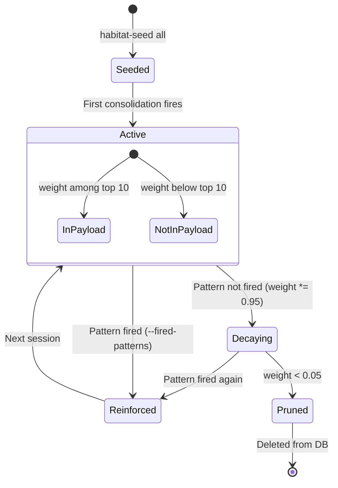

> Back to: [[HOME]] | [[System Verification Report]] | [[Hebbian Lifecycle Wiring]] | [[Complete Wiring Schematic]] | [[README.md]](`~/claude-code-workspace/memory-injection/README.md`)
> POVM namespace: `habitat_injection_fidelity_*`

# Fidelity Tuning Guide — habitat-injection

> How to calibrate the injection system for maximum signal-to-noise ratio.
> Constants, weight dynamics, data lifecycle, and when to intervene.
> Created: 2026-04-25 (S111)

---

## Tuning Parameters

### Hebbian Learning Constants

| Parameter | Default | Config Key | Effect |
|-----------|---------|------------|--------|
| Decay rate | 0.95 | `consolidation.decay_rate` | Unfired patterns lose 5% per session. Lower = faster forgetting |
| Reinforce rate | 0.1 | `consolidation.reinforce_rate` | Fired patterns gain 10% of remaining headroom. Higher = faster learning |
| Prune threshold | 0.05 | `consolidation.prune_threshold` | Patterns below this weight are deleted. Higher = more aggressive pruning |
| Auto-resolve sessions | 10 | `consolidation.auto_resolve_sessions` | Chains untouched for N sessions resolve. Lower = faster cleanup |

### Injection Budget Constants

| Parameter | Default | Config Key | Effect |
|-----------|---------|------------|--------|
| Token budget | 1100 | `injection.token_budget` | Total tokens in payload. Higher = more context, slower injection |
| Max chains | 5 | `injection.max_chains` | Chains shown in payload. Higher = more bug visibility |
| Max patterns | 10 | `injection.max_patterns` | Patterns used for cache. More = broader behavioral guidance |
| Max trajectory | 5 | `injection.max_trajectory_points` | Sessions shown in trajectory. More = longer fitness history |
| Max workstreams | 10 | `injection.max_workstreams` | Workstreams in payload. More = broader project context |
| Max payload bytes | 15360 | `injection.max_payload_bytes` | Hard size limit. 15KB generous ceiling |
| Max latency ms | 100 | `injection.max_latency_ms` | Target injection speed |

### Cache & Retention

| Parameter | Default | Config Key | Effect |
|-----------|---------|------------|--------|
| Cache rebuild interval | 60s | `consolidation.cache_rebuild_secs` | How stale Tier 1 cache can be |
| Decay interval | 21600s (6h) | `consolidation.decay_interval_secs` | How often decay runs in daemon mode |
| Envelope days | 30 | `retention.envelope_days` | Days before payloads stripped to headers |
| Delete days | 90 | `retention.delete_days` | Days before full event deletion |

### Environment Variable Overrides

```bash
export HABITAT_DB_PATH="$HOME/.local/share/habitat/injection.db"
export HABITAT_TOKEN_BUDGET=1100
export HABITAT_DECAY_RATE=0.95
export HABITAT_REINFORCE_RATE=0.1
export HABITAT_STDB_PORT=3000
```

---

## Weight Dynamics

### Convergence Behavior

A pattern that fires every session converges to a **balance point** where decay and reinforcement cancel:

```
At equilibrium: weight * decay_rate = weight - reinforce_rate * (1 - weight)
Solving: w_eq ≈ 0.667 (for decay=0.95, reinforce=0.1)
```

A pattern that never fires after being created at 0.5:

```
Session 1:  0.500
Session 10: 0.500 * 0.95^10 = 0.299
Session 20: 0.500 * 0.95^20 = 0.179
Session 40: 0.500 * 0.95^40 = 0.064
Session 58: 0.500 * 0.95^58 = 0.048 → PRUNED (< 0.05)
```

**Half-life:** ~13.5 sessions (a pattern at any weight reaches half that weight after ~13.5 unfired sessions).

### Current Weight Distribution (S111)

| Band | Count | Interpretation |
|------|-------|----------------|
| 0.45-0.50 | ~55 | Default weight — recently seeded, not yet reinforced |
| 0.50-0.55 | ~15 | Slightly reinforced (1-3 fires) |
| 0.55-0.60 | ~10 | Moderately active (3-6 fires + decay) |
| >0.60 | 0 | No highly-reinforced patterns yet (system is young) |

**Interpretation:** The system was bulk-seeded — most patterns are at default weight (0.5). As sessions progress and `habitat-consolidate --fired-patterns` names specific patterns, the distribution will differentiate into clearly active vs. fading patterns. This is the expected Hebbian behavior — the system will self-organize.

---

## Tuning Scenarios

### Scenario: Patterns are pruning too fast

Patterns disappear before they have a chance to be reinforced.

**Diagnosis:**
```bash
sqlite3 ~/.local/share/habitat/injection.db "SELECT COUNT(*) FROM reinforced_pattern WHERE weight < 0.1;"
```

**Fix:** Lower the decay rate or raise the prune threshold:
```bash
export HABITAT_DECAY_RATE=0.97   # Was 0.95 — slower forgetting
```

### Scenario: Injection payload is too generic

The same chains and workstreams appear every session without change.

**Diagnosis:** Not enough consolidation runs, or `--fired-patterns` never passed.

**Fix:**
```bash
# Run consolidation with actual fired patterns
habitat-consolidate --session 112 --fired-patterns quality-gate-chain,verify-before-ship,binary-deployment-cp

# The fired patterns get reinforced, unfired ones decay
# Over 5-10 sessions, the system differentiates naturally
```

### Scenario: Too many unresolved chains

Old bugs/traps that are no longer relevant clog the injection payload.

**Diagnosis:**
```bash
habitat-query chains --limit 20
```

**Fix:** Either manually resolve or lower `auto_resolve_sessions`:
```bash
# Manual resolve
sqlite3 ~/.local/share/habitat/injection.db "UPDATE causal_chain SET resolved_session = 111 WHERE label = 'old-bug-label';"

# Or auto-resolve faster (default 10 sessions)
# In config: consolidation.auto_resolve_sessions = 5
```

### Scenario: Injection payload is stale / doesn't reflect recent work

**Diagnosis:** Consolidation not running after sessions.

**Fix:** Run consolidation after every session:
```bash
habitat-consolidate --session $CURRENT_SESSION
```

**Future:** Wire into `/save-session` hook for automatic post-session consolidation.

---

## Data Lifecycle



### Chain Lifecycle

```
Discovered → Active (reinforcement_count = 1)
Active → Reinforced (same label appears in checkpoint)
Reinforced → Auto-resolved (inactive ≥ 10 sessions)
Active → Manually resolved (resolved_session set)
```

### Session Trajectory Lifecycle

```
Captured → Stored (insert_point idempotent per session_id)
Stored → In payload (last 5 sessions)
Stored → Archived (beyond last 5, still in DB for queries)
```

---

## Habitat Integration Points

### How to Feed the System

1. **Post-session consolidation** (most important):
   ```bash
   habitat-consolidate --session $N --fired-patterns pattern1,pattern2
   ```

2. **Manual chain discovery:**
   ```bash
   sqlite3 ~/.local/share/habitat/injection.db \
     "INSERT INTO causal_chain (origin_session, chain_type, label, description) \
      VALUES (111, 'bug', 'BUG-NEW', 'description of new bug');"
   ```

3. **Workstream updates:**
   ```bash
   sqlite3 ~/.local/share/habitat/injection.db \
     "UPDATE workstream SET status = 'complete', last_touched_session = 111 \
      WHERE ws_id = 'some-workstream';"
   ```

4. **Cache rebuild after manual changes:**
   ```bash
   habitat-consolidate --session $N
   ```

### How the System Feeds Claude Code

Every new Claude Code session receives:
1. **Orientation:** What you were working on + fitness trend
2. **Trajectory:** Last 5 sessions with fitness deltas
3. **Workstreams:** Active/blocked work with resume instructions
4. **Unresolved chains:** Top bugs/traps by frequency (what the habitat keeps rediscovering)
5. **Health:** Service count + thermal state

This replaces the old pattern of manually reading CLAUDE.local.md at session start — the injection does it automatically in <100ms.

---

## Hebbian Learning Quality Metrics

Track these over time to verify the learning system is working:

| Metric | Healthy Range | How to Check |
|--------|--------------|--------------|
| Active patterns (weight > 0.5) | >20% of total | `SELECT COUNT(*) FROM reinforced_pattern WHERE weight > 0.5;` |
| Pruned per session | 0-3 | Output from `habitat-consolidate` |
| Weight variance | >0.05 (std dev) | `SELECT printf('%.4f', AVG((weight - avg_w) * (weight - avg_w))) FROM reinforced_pattern, (SELECT AVG(weight) as avg_w FROM reinforced_pattern);` |
| Unresolved chain count | 5-20 | `SELECT COUNT(*) FROM causal_chain WHERE resolved_session IS NULL;` |
| Auto-resolved per session | 0-5 | Output from `habitat-consolidate` |

If weight variance is near zero, all patterns have the same weight — the system isn't differentiating. Run more sessions with `--fired-patterns` to trigger Hebbian learning.

---

## Cross-References

- **Hebbian Lifecycle:** [[Hebbian Lifecycle Wiring]] — 4-step cycle, weight trajectories
- **Injection Payload:** [[Injection Payload Format]] — token budgets, section priorities
- **System Verification:** [[System Verification Report]] — latest test results
- **Diagnostics:** [[Diagnostics Runbook]] — troubleshooting
- **Architecture:** [[Data Flow]] — write/read paths
- **Consent Model:** [[Consent Model]] — Emit/Store/Forget gates
- **m05 constants source:** `src/m1_foundation/m05_constants.rs`
- **m03 config source:** `src/m1_foundation/m03_config.rs`
- **m16 Hebbian source:** `src/m4_consolidation/m16_hebbian_engine.rs`
