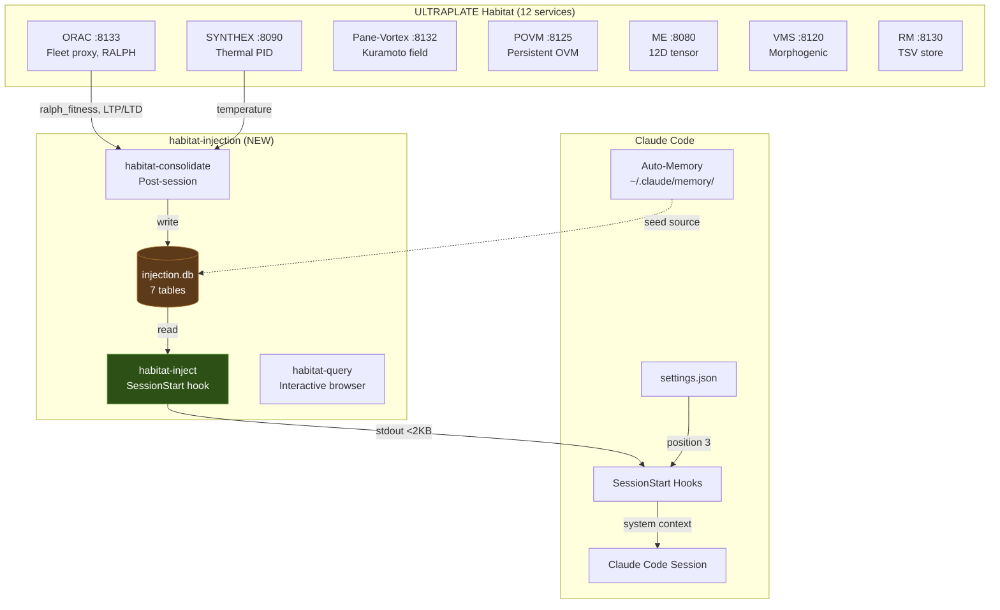
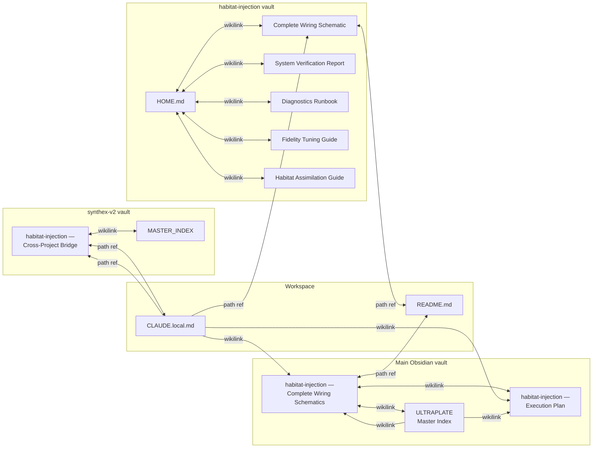

> Back to: [[HOME]] | [[Complete Wiring Schematic]] | [[System Verification Report]] | [[README.md]](`~/claude-code-workspace/memory-injection/README.md`)
> POVM namespace: `habitat_injection_assimilation_*`

# Habitat Assimilation Guide — habitat-injection

> How habitat-injection fits into the ULTRAPLATE ecosystem. Service integration,
> data flow across services, POVM namespace conventions, and bidirectional bridges.
> Created: 2026-04-25 (S111)

---

## Ecosystem Position



---

## Service Integration Map

### Data Consumed FROM Habitat Services

| Source | Endpoint | Data | Consumer Binary | Frequency |
|--------|----------|------|-----------------|-----------|
| ORAC | `:8133/health` | `ralph_fitness`, `hebbian_ltp_total`, `hebbian_ltd_total` | `habitat-consolidate` | Per consolidation |
| SYNTHEX | `:8090/v3/thermal` | `temperature` | `habitat-consolidate` | Per consolidation |
| SYNTHEX | `:8090/api/health` | HTTP 200 probe | `habitat-consolidate` | Per consolidation |
| 10 ports | Various `/health` | HTTP 200 count | `habitat-consolidate` | Per consolidation |

### Data Provided TO Claude Code

| Output | Format | Size | Latency | Consumer |
|--------|--------|------|---------|----------|
| Injection payload | Markdown prose | <2KB, ~200 tokens | <100ms | Claude Code system context |
| Query results | Formatted tables | Variable | <50ms | Interactive terminal |
| Health JSON | `application/json` | ~500B | <10ms | `:8140/health` (daemon) |

### Data NOT Consumed (By Design)

| Service | Why Not |
|---------|---------|
| POVM `:8125` | Phase 2 — STDB ingester will poll pathways |
| PV2 `:8132` | Phase 2 — STDB ingester will subscribe to sphere events |
| RM `:8130` | Phase 2 — STDB ingester via event-driven hook |
| ME `:8080` | Phase 2 — via STDB `GradientSnapshot` table |
| VMS `:8120` | Phase 2 — STDB consolidation trigger |

---

## POVM Namespace Conventions

habitat-injection uses 6 POVM namespace prefixes, each for a different aspect:

| Prefix | Purpose | Created By |
|--------|---------|-----------|
| `habitat_injection_*` | Original 11 implementation pathways | S110 implementation |
| `habitat_injection_wiring_*` | System topology schematic anchors | S111 schematic pass |
| `habitat_injection_api_*` | API endpoint documentation anchors | S111 schematic pass |
| `habitat_injection_hebbian_*` | Hebbian learning cycle anchors | S111 schematic pass |
| `habitat_injection_payload_*` | Injection payload format anchors | S111 schematic pass |
| `habitat_injection_stdb_*` | SpaceTimeDB Phase 2 anchors | S111 schematic pass |
| `habitat_injection_verification_*` | Verification report anchors | S111 verification |
| `habitat_injection_diagnostics_*` | Diagnostics runbook anchors | S111 diagnostics |
| `habitat_injection_fidelity_*` | Fidelity tuning anchors | S111 tuning guide |
| `habitat_injection_assimilation_*` | This guide | S111 assimilation |

All follow the P30 convention: `{service}_{domain}_*` prefix prevents collision with other services' POVM pathways (e.g., `synthex_v2_*`, `orac_*`).

---

## Memory Substrate Integration

habitat-injection touches 4 of the 6 Habitat memory systems:

| # | Memory System | How habitat-injection Integrates |
|---|--------------|----------------------------------|
| 1 | **Auto-Memory** (`~/.claude/memory/`) | Seed source: memory files inform `causal_chain` and `reinforced_pattern` rows |
| 2 | **SQLite DBs** (`developer_environment_manager/*.db`) | Seed source: `service_tracking.db` patterns feed `reinforced_pattern`; `hebbian_pulse.db` informs trap chains |
| 3 | **Reasoning Memory** (`:8130`) | Phase 2: STDB ingester will write TSV entries via RM bridge |
| 4 | **MCP Knowledge Graph** | Not integrated — POVM pathways serve a similar role |
| 5 | **Obsidian Vault** (`~/projects/claude_code/`) | Bidirectional: vault notes document the system; main vault has cross-reference note |
| 6 | **Shared Context** (`~/projects/shared-context/`) | Seed source: session notes inform `session_trajectory` and `workstream` rows |

---

## Bidirectional Bridge Map

Every note that references habitat-injection has a corresponding backlink:



---

## Assimilation Checklist (New Session Bootstrap)

When starting a new session, the injection system provides context automatically. But for full assimilation, also check:

1. **Injection fired?** First line of system context should show `## Session SNNN Injection (NNN tokens)`
2. **Cache fresh?** `sqlite3 ~/.local/share/habitat/injection.db "SELECT (strftime('%s','now')-computed_at) FROM injection_cache;"` — should be <60s after recent consolidation
3. **Services healthy?** The Health section of the payload shows service count
4. **Chains current?** The Unresolved Chains section should reflect actual current work
5. **Workstreams accurate?** The Workstreams section should match CLAUDE.local.md

If any of these are stale, run:
```bash
habitat-consolidate --session $CURRENT_SESSION
```

---

## Phase 2 Integration Roadmap

When SpaceTimeDB integration ships (feature flag `stdb` + `ingester`):

| Integration | What Changes |
|-------------|-------------|
| ORAC polling | Moves from consolidate-time curl to 30s ingester poll → `GradientSnapshot` table |
| SYNTHEX polling | Moves from consolidate-time curl to 60s ingester poll → `GradientSnapshot` table |
| PV2 subscription | NEW — event-driven sphere events → `HabitatEvent` table |
| POVM sync | NEW — 300s pathway sync → `KnowledgeEdge` table |
| Watcher digest | NEW — Watcher observations → `WatcherObservation` table |
| Injection source | Injection can query STDB in addition to SQLite — richer data |
| Dual-write transition | SQLite remains canonical during migration; STDB shadows |

**Kill criteria:** 20 sessions without improvement → revert to SQLite-only.

---

## Cross-References

- **Complete Wiring:** [[Complete Wiring Schematic]] — system topology
- **API Endpoints:** [[API Endpoints Map]] — all consumed/served endpoints
- **STDB Phase 2:** [[STDB Phase 2 Wiring]] — future integration plan
- **System Verification:** [[System Verification Report]] — latest test results
- **Diagnostics:** [[Diagnostics Runbook]] — troubleshooting
- **Fidelity Tuning:** [[Fidelity Tuning Guide]] — weight calibration
- **Consent Model:** [[Consent Model]] — Emit/Store/Forget gates
- **Data Flow:** [[Data Flow]] — write/read paths
- **Main vault:** `~/projects/claude_code/habitat-injection — Complete Wiring Schematics.md`
- **synthex-v2 vault:** `~/claude-code-workspace/synthex-v2/obsidian-synthex-v2/synthex-v2/habitat-injection — Cross-Project Bridge.md`
- **Workspace:** `~/claude-code-workspace/CLAUDE.local.md` § habitat-injection anchors
