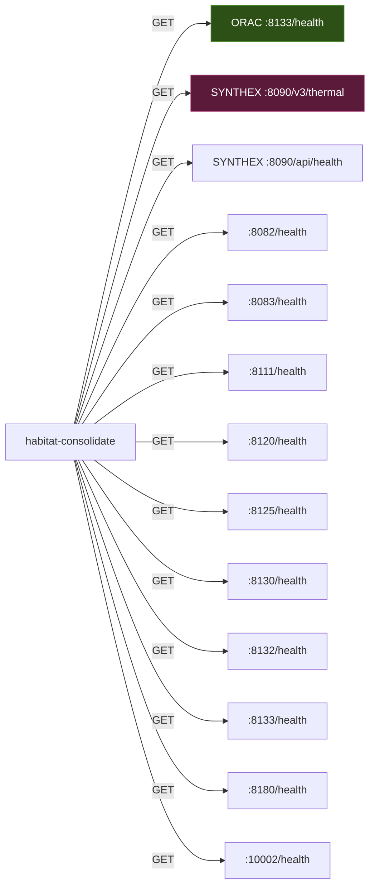

> Back to: [[HOME]] | [[Complete Wiring Schematic]] | [[README.md]](`~/claude-code-workspace/memory-injection/README.md`)
> POVM namespace: `habitat_injection_api_*`

# API Endpoints Map — habitat-injection

> Every HTTP endpoint consumed, served, and planned. Port assignments, health paths, response formats.
> Created: 2026-04-25 (S111 schematic pass)

---

## Endpoints Served by habitat-injection

### habitat-memory daemon (:8140)

| Method | Path | Response | Status |
|--------|------|----------|--------|
| GET | `/health` | `{"status":"healthy","service":"habitat-injection","version":"0.1.0","schema_version":3,"chains":N,"sessions":N,"patterns":N,"workstreams":N,"db":"path"}` | Phase 1 |

**Implementation:** Hand-rolled HTTP (no framework). TCP listener on `127.0.0.1:8140`. Single-threaded accept loop. Non-`/health` paths return 404.

**Port override:** `HABITAT_MEMORY_PORT` env var.

---

## Endpoints Consumed by habitat-injection

### habitat-consolidate reads from:



### Detailed Endpoint Contracts

#### ORAC :8133/health
```json
{
  "ralph_gen": 25652,
  "ralph_fitness": 0.669,
  "ralph_phase": "Recognize",
  "hebbian_ltp_total": 47,
  "hebbian_ltd_total": 0,
  "emergence_events": 3449,
  "coupling_connections": 0,
  "system_grade": "A"
}
```
**Fields consumed:** `ralph_fitness`, `hebbian_ltp_total`, `hebbian_ltd_total`
**Consumer:** `fetch_health_snapshot()` in `habitat_consolidate.rs`
**Failure mode:** Returns default snapshot (fitness=0.5, all zeros) on curl failure

#### SYNTHEX :8090/v3/thermal
```json
{
  "temperature": 0.244,
  "target": 0.5,
  "delta": -0.256,
  "pid_output": -0.214,
  "heat_sources": { "hs_001": 0.1, "hs_002": 0.05, "hs_003": 0.02 }
}
```
**Fields consumed:** `temperature`
**Consumer:** `fetch_health_snapshot()` in `habitat_consolidate.rs`
**Failure mode:** thermal_t defaults to 0.0

#### Service Health Probes (10 ports)
**Request:** `GET /health` (1s timeout per probe)
**Expected:** HTTP 200
**Ports:** 8082, 8083, 8111, 8120, 8125, 8130, 8132, 8133, 8180, 10002
**Plus:** SYNTHEX 8090 via `/api/health` (different path)
**Consumer:** `count_healthy_services()` in `habitat_consolidate.rs`
**Output:** Integer count of responding services

---

## Phase 2 Planned Endpoints (SpaceTimeDB Ingester)

### Ingester Source Polling

| Source | Default URL | Poll Interval | Events |
|--------|-----------|---------------|--------|
| ORAC | `http://localhost:8133` | 30s | Health snapshots → `GradientSnapshot` |
| PV2 | `http://localhost:8132` | Event-driven | Sphere events → `HabitatEvent` |
| SYNTHEX | `http://localhost:8090` | 60s | Thermal + system state → `GradientSnapshot` |
| POVM | `http://localhost:8125` | 300s | Pathway sync → `KnowledgeEdge` |
| Atuin Hooks | Local subprocess | Event-driven | Command events → `HabitatEvent` |

### Ingester Health Endpoint (Planned)

| Method | Path | Port | Response |
|--------|------|------|----------|
| GET | `/health` | 3001 | `{"healthy":bool,"uptime_secs":N,"sources":[...],"total_events":N,"stdb_connected":bool}` |

---

## Port Registry

| Port | Service | Phase | Owner |
|------|---------|-------|-------|
| 3000 | SpaceTimeDB module | Phase 2 | `m22_stdb_module` |
| 3001 | Ingester health | Phase 2 | `m23_ingester` |
| 8080 | Maintenance Engine | External | Read by consolidate |
| 8082 | DevOps V3 | External | Health probe |
| 8083 | DevOps V3 alt | External | Health probe |
| 8090 | SYNTHEX | External | `/api/health` + `/v3/thermal` |
| 8111 | CodeSynthor V8 | External | Health probe |
| 8120 | VMS | External | Health probe |
| 8125 | POVM | External | Health probe |
| 8130 | Reasoning Memory | External | Health probe |
| 8132 | Pane-Vortex | External | Health probe |
| 8133 | ORAC | External | `/health` (full) |
| 8140 | habitat-memory | Phase 1 | `/health` (served) |
| 8180 | ME V2 | External | Health probe |
| 10002 | Prometheus Swarm | External | Health probe |

---

## Cross-References

- **README:** [`README.md`](~/claude-code-workspace/memory-injection/README.md) — port table context
- **Complete Wiring:** [[Complete Wiring Schematic]] — full system topology
- **Binary Map:** [[Binary Map]] — which binary calls which endpoint
- **POVM:** `habitat_injection_api_*` namespace
- **Tracking DB:** injection.db `session_trajectory` stores health probe results
- [[Hook Registration]] — how inject hooks into SessionStart chain
