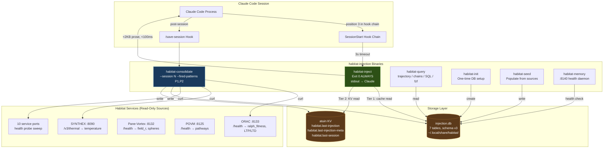
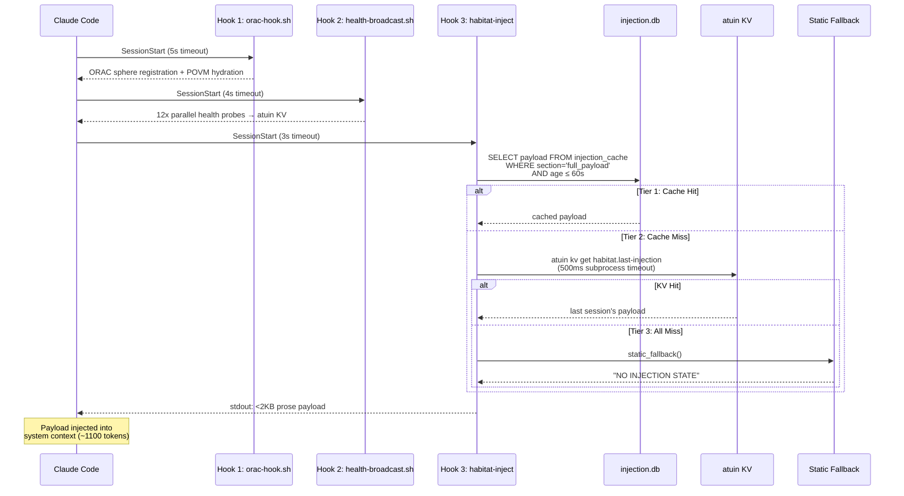
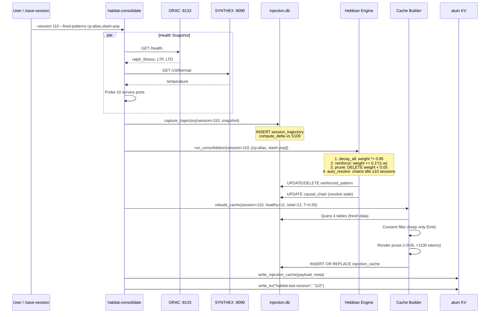
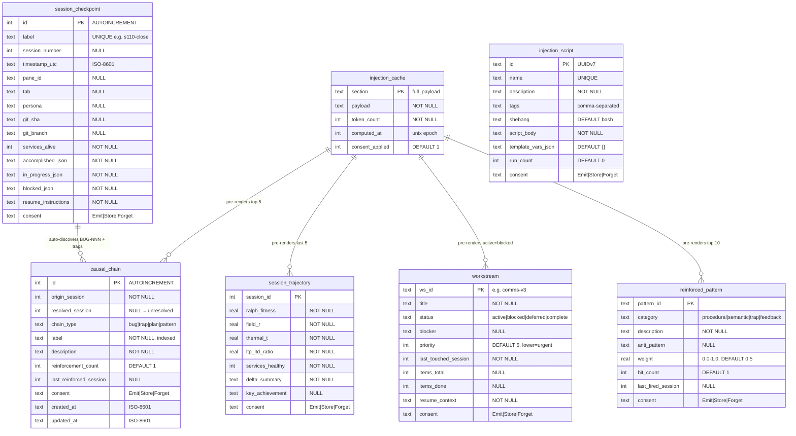
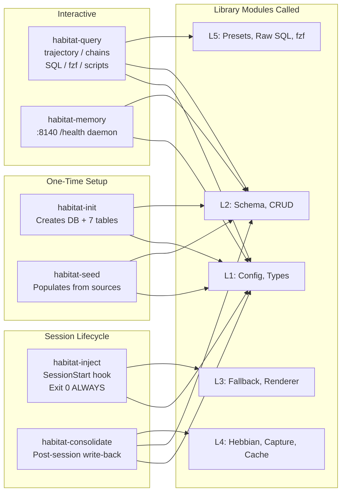
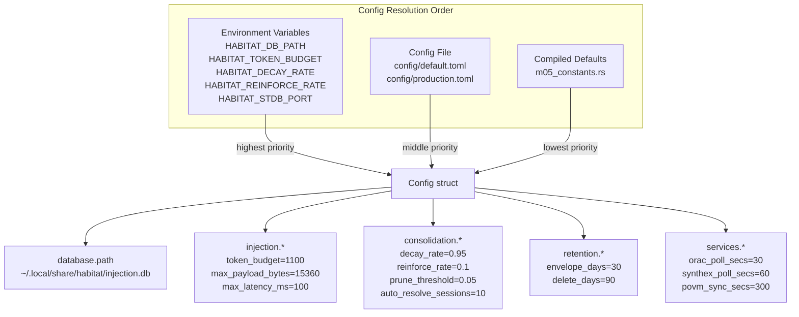
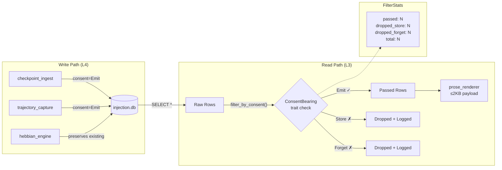

> Back to: [[HOME]] | [[Architecture Overview]] | [[README.md]](`~/claude-code-workspace/memory-injection/README.md`)
> POVM namespace: `habitat_injection_wiring_*`
> Tracking DB: `~/.local/share/habitat/injection.db` (7 tables, schema v3)

# Complete Wiring Schematic — habitat-injection

> 6 layers | 27 modules | 7 CLI binaries | 3-tier fallback | 4-step Hebbian cycle
> Created: 2026-04-25 (S111 schematic pass)

---

## System Overview

---

## SessionStart Hook Chain (Wiring Position)

---

## Post-Session Consolidation Pipeline

---

## Database Schema Wiring (7 Tables)

---

## Layer Dependency Wiring

```mermaid
graph BT
    subgraph "L1 Foundation"
        M01[m01_types<br/>10 newtypes]
        M02[m02_errors<br/>6 error enums]
        M03[m03_config<br/>TOML + env]
        M04[m04_traits<br/>4 core traits]
        M05[m05_constants<br/>27 constants]
    end

    subgraph "L2 Schema & Persistence"
        M06[m06_schema<br/>7 tables, v3]
        M07[m07_causal_chain<br/>CRUD + reinforce]
        M08[m08_trajectory<br/>CRUD + OLS trend]
        M09[m09_workstream<br/>CRUD + status FSM]
        M10[m10_pattern<br/>CRUD + decay/prune]
        M10B[m10b_checkpoint<br/>CRUD + JSON arrays]
    end

    subgraph "L3 Injection Engine"
        M11[m11_parallel_query<br/>4-query executor]
        M12[m12_prose_renderer<br/>5-section ≤2KB]
        M13[m13_fallback<br/>3-tier chain]
        M14[m14_consent_filter<br/>Emit/Store/Forget]
    end

    subgraph "L4 Consolidation Engine"
        M15[m15_checkpoint_ingest<br/>BUG-NNN regex]
        M15B[m15b_trajectory_capture<br/>health snapshot]
        M16[m16_hebbian_engine<br/>4-step cycle]
        M17[m17_cache_builder<br/>render + write]
        M18[m18_atuin_cache<br/>3-key KV]
    end

    subgraph "L5 Query & Browser"
        M19[m19_preset_queries<br/>5 presets]
        M20[m20_raw_query<br/>read-only SQL]
        M21[m21_fzf_browser<br/>fzf + fallback]
        M21B[m21b_scripts_engine<br/>CRUD + exec]
    end

    subgraph "L6 SpaceTimeDB (Phase 2)"
        M22[m22_stdb_module<br/>8 tables]
        M23[m23_ingester<br/>5 sources]
        M24[m24_migration<br/>SQLite → STDB]
    end

    M06 --> M01
    M06 --> M02
    M07 --> M06
    M08 --> M06
    M09 --> M06
    M10 --> M06
    M10B --> M06

    M11 --> M07
    M11 --> M08
    M11 --> M09
    M11 --> M10
    M12 --> M01
    M13 --> M11
    M14 --> M01

    M15 --> M07
    M15 --> M10B
    M15B --> M08
    M16 --> M10
    M16 --> M07
    M17 --> M11
    M17 --> M12
    M17 --> M14
    M18 --> M03

    M19 --> M07
    M19 --> M08
    M19 --> M09
    M19 --> M10
    M20 --> M06
    M21 --> M19
    M21B --> M06

    M22 --> M01
    M23 --> M03
    M24 --> M22
    M24 --> M06
```

---

## CLI Binary Wiring Map

| Binary | Args | Calls | Exit Codes |
|--------|------|-------|------------|
| `habitat-init` | `[db_path]` | `Config::load`, `open_database`, `list_tables`, `schema_version` | 0=ok, 1=error |
| `habitat-inject` | (none) | `Config::load`, `execute_fallback_chain` | 0 ALWAYS |
| `habitat-seed` | `all\|chains\|trajectory\|workstreams\|patterns` | `Config::load`, `open_database`, `insert_*`, `find_by_label`, `reinforce_chain` | 0=ok, 1=error |
| `habitat-consolidate` | `--session N [--fired-patterns P1,P2]` | `Config::load`, `open_database`, `capture_trajectory`, `run_consolidation`, `rebuild_cache`, `write_injection_cache` | 0=ok, 1=error |
| `habitat-query` | `trajectory\|chains\|workstreams\|patterns\|summary\|--interactive\|"SELECT ..."` | `Config::load`, `open_database`, `query_preset`, `execute_raw_formatted`, `browse_table` | 0=ok, 1=error |
| `habitat-memory` | (none, env `HABITAT_MEMORY_PORT`) | `Config::load`, `open_database`, TCP listener, `health_response` | 0=ok, 1=error |

---

## External Service Wiring (Read-Only)

| Service | Port | Endpoint | Data Consumed | Consumer |
|---------|------|----------|---------------|----------|
| ORAC | 8133 | `/health` | `ralph_fitness`, `hebbian_ltp_total`, `hebbian_ltd_total` | `habitat-consolidate` |
| SYNTHEX | 8090 | `/v3/thermal` | `temperature` | `habitat-consolidate` |
| SYNTHEX | 8090 | `/api/health` | health probe | `habitat-consolidate` |
| PV2 | 8132 | `/health` | `field_r`, `spheres` | `habitat-consolidate` (Phase 2) |
| POVM | 8125 | `/health` | `pathways` count | `habitat-consolidate` (Phase 2) |
| 10 ports | various | `/health` | HTTP 200 count | `habitat-consolidate` → `count_healthy_services()` |

**Service ports probed by consolidate:**
`8082, 8083, 8111, 8120, 8125, 8130, 8132, 8133, 8180, 10002` + SYNTHEX `8090/api/health`

---

## Atuin KV Namespace Wiring

| Key | Written By | Read By | Format | Purpose |
|-----|-----------|---------|--------|---------|
| `habitat.last-injection` | `m18_atuin_cache` via consolidate | `m13_fallback` via inject (Tier 2) | Plain text (<2KB) | Fallback injection payload |
| `habitat.last-injection-meta` | `m18_atuin_cache` via consolidate | `m18_atuin_cache::read_injection_cache` | JSON `{payload, token_count, session_number, timestamp_utc}` | Structured cache metadata |
| `habitat.last-session` | `habitat-consolidate` | Scripts, diagnostics | Decimal string (e.g. "110") | Last consolidated session |

---

## Configuration Wiring

---

## Consent Wiring (Security Gate)

Every row in `causal_chain`, `session_trajectory`, `workstream`, `reinforced_pattern`, and `session_checkpoint` carries a `consent` column. Only `"Emit"` rows enter the injection payload. `"Store"` rows persist but stay private. `"Forget"` rows are marked for deletion.

---

## Cross-References

- **POVM pathways:** `habitat_injection_wiring_*` namespace — schematic root + per-diagram anchors
- **Tracking DB:** `~/.local/share/habitat/injection.db` — 7 tables documented above
- **README:** [`README.md`](~/claude-code-workspace/memory-injection/README.md) — architecture summary, module table, deliberation origin
- **Execution Plan:** [[Execution Plan]] — 11-step deployment (S110-S114)
- **Vault layers:** [[L1 Foundation]] | [[L2 Schema & Persistence]] | [[L3 Injection Engine]] | [[L4 Consolidation Engine]] | [[L5 Query & Browser]] | [[L6 SpaceTimeDB Migration]]
- **Architecture:** [[Architecture Overview]] | [[Data Flow]] | [[Dependency Graph]]
- **Operations:** [[Hook Registration]] | [[Binary Map]] | [[Injection Database State]]
