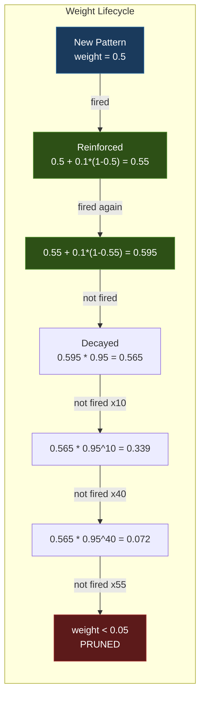
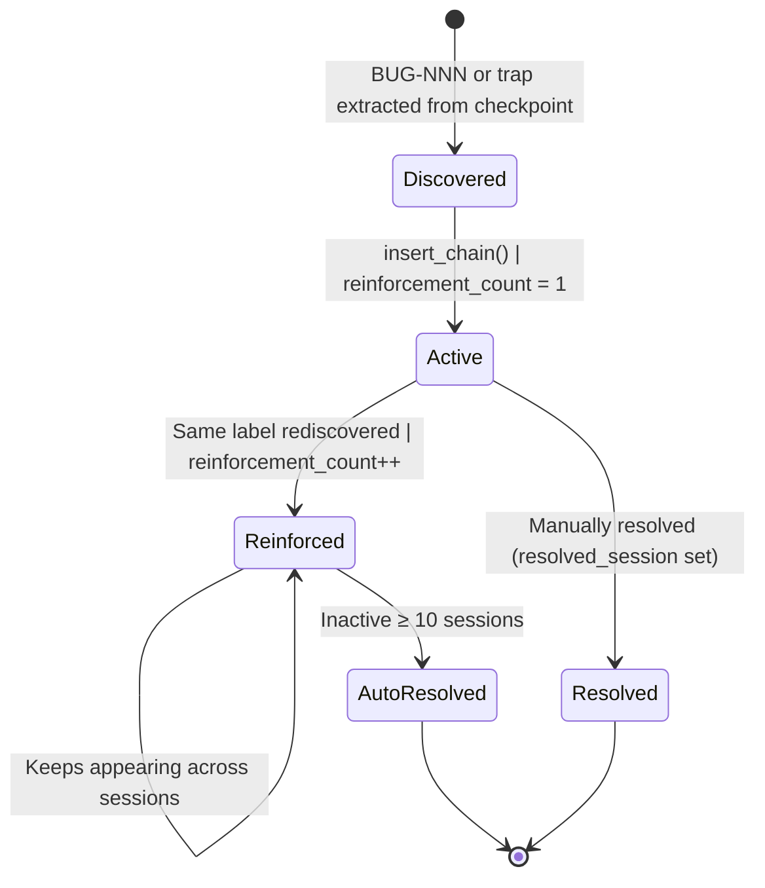
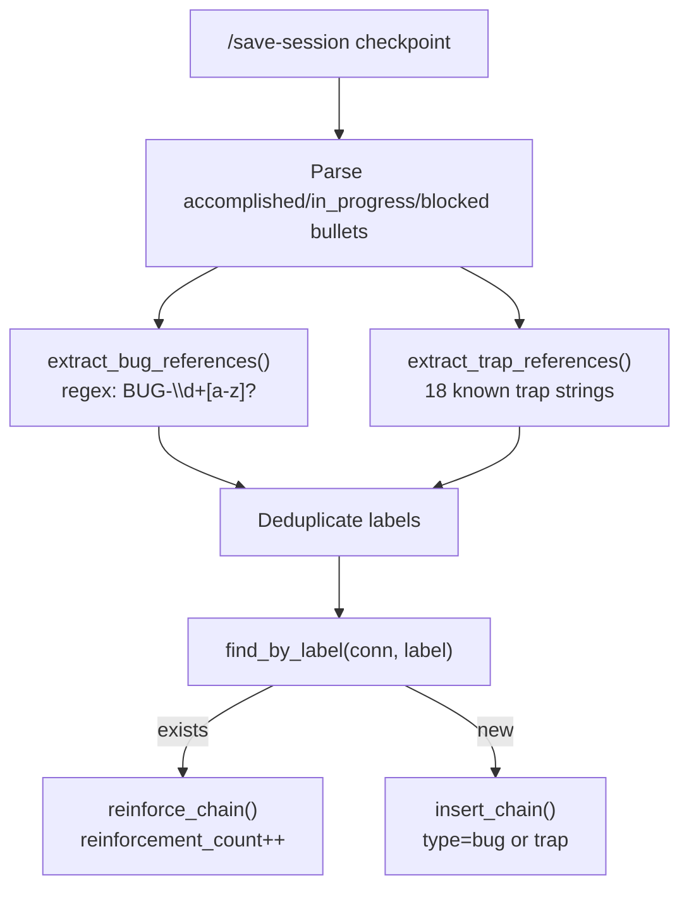
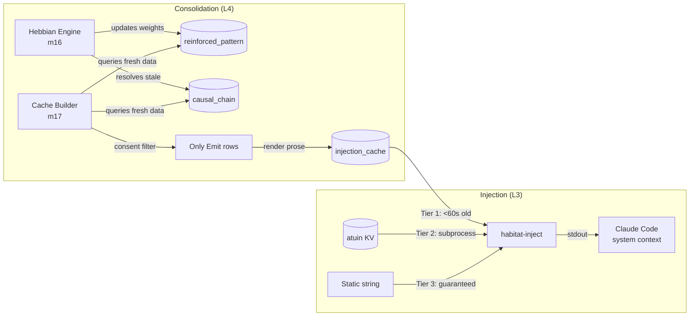

> Back to: [[HOME]] | [[Complete Wiring Schematic]] | [[Hebbian Learning]] | [[README.md]](`~/claude-code-workspace/memory-injection/README.md`)
> POVM namespace: `habitat_injection_hebbian_*`

# Hebbian Lifecycle Wiring — habitat-injection

> The 4-step atomic consolidation cycle: decay → reinforce → prune → auto-resolve.
> How patterns and causal chains evolve across sessions through Hebbian learning.
> Created: 2026-04-25 (S111 schematic pass)

---

## Hebbian Cycle Overview

```mermaid
stateDiagram-v2
    [*] --> Decay: run_consolidation() called
    Decay --> Reinforce: weight *= 0.95 for all fired patterns
    Reinforce --> Prune: weight += 0.1*(1-w) for named fired
    Prune --> AutoResolve: DELETE where weight < 0.05
    AutoResolve --> [*]: resolve chains idle ≥ 10 sessions

    state Decay {
        [*] --> SelectFired: WHERE last_fired_session IS NOT NULL
        SelectFired --> MultiplyWeight: weight = weight * 0.95
        MultiplyWeight --> UpdateTimestamp: updated_at = now()
    }

    state Reinforce {
        [*] --> MatchPattern: Find pattern_id in fired_patterns[]
        MatchPattern --> HebbianUpdate: weight += 0.1 * (1.0 - weight)
        HebbianUpdate --> IncrementHit: hit_count += 1
        IncrementHit --> SetSession: last_fired_session = current
    }

    state Prune {
        [*] --> FindWeak: WHERE weight < 0.05
        FindWeak --> DeleteRow: DELETE FROM reinforced_pattern
    }

    state AutoResolve {
        [*] --> FindStale: WHERE (session - last_active) >= 10
        FindStale --> MarkResolved: resolved_session = current
    }
```

---

## Pattern Weight Trajectory

### Key Constants

| Constant | Value | Module | Purpose |
|----------|-------|--------|---------|
| `DECAY_RATE` | 0.95 | m05_constants | Unfired patterns lose 5% per session |
| `REINFORCE_RATE` | 0.1 | m05_constants | Fired patterns gain 10% of remaining headroom |
| `PRUNE_THRESHOLD` | 0.05 | m05_constants | Patterns below 5% weight get deleted |
| `AUTO_RESOLVE_SESSIONS` | 10 | m05_constants | Chains untouched for 10 sessions → resolved |

### Mathematical Properties

- **Reinforcement ceiling:** Approaches 1.0 asymptotically (weight += rate * (1 - weight))
- **Decay half-life:** ~13.5 sessions (0.95^13.5 ≈ 0.5)
- **Prune horizon:** A pattern at 0.5 that stops firing will prune in ~58 sessions
- **Convergence:** Actively-fired patterns stabilise near weight ≈ 0.67 (where decay and reinforce balance)
- **NaN guard:** `PatternWeight::new()` rejects NaN, clamps to [0.0, 1.0]

---

## Causal Chain Lifecycle

### Chain Discovery Pipeline

**18 Known Trap Patterns:**
`cp-alias`, `pkill-exit-144`, `rm-tsv-only`, `povm-hydrate-broken`, `bridge-url-prefix`, `pswarm-port-10002`, `synthex-api-health`, `me-port-8180`, `zellij-wasm-no-http`, `pv2-ipc-socket`, `synthex-v2-no-v3`, `povm-pathways-plural`, `unwrap-in-wasm`, `timer-5s-minimum`, `focus-next-pane`, `synthex-ws-collision`, `orac-breakers-cascade`, `pv2-governance-gated`

---

## Data Flow: Hebbian → Injection

---

## Execution Order (Critical for Convergence)

The 4 steps MUST execute in this order within `run_consolidation()`:

1. **Decay** — Apply 0.95x to all patterns that have ever fired. This ensures that reinforcement in step 2 is relative to the decayed weight, not the pre-decay weight.

2. **Reinforce** — Apply 0.1*(1-w) to named fired patterns. Order after decay means a pattern that fires every session converges to the balance point (~0.67), not to 1.0.

3. **Prune** — Delete patterns below 0.05. Order after reinforce means a just-fired pattern won't be accidentally pruned even if it was below threshold before reinforcement.

4. **Auto-resolve** — Resolve causal chains inactive for ≥10 sessions. Order last because chain resolution doesn't affect pattern weights.

---

## Cross-References

- **Consent Model:** [[Consent Model]] — how Emit/Store/Forget gates injection
- **Complete Wiring:** [[Complete Wiring Schematic]] — system-level topology
- **L4 Layer:** [[L4 Consolidation Engine]] — implementation details
- **m16 source:** `src/m4_consolidation/m16_hebbian_engine.rs`
- **m10 source:** `src/m2_schema/m10_pattern.rs` — CRUD for reinforced_pattern
- **m07 source:** `src/m2_schema/m07_causal_chain.rs` — CRUD + auto_resolve_stale
- **README:** [`README.md`](~/claude-code-workspace/memory-injection/README.md) — The One Query
- **POVM:** `habitat_injection_hebbian_*` namespace
