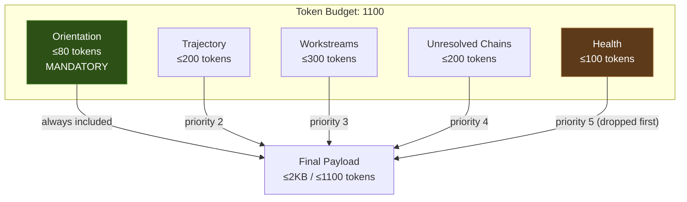
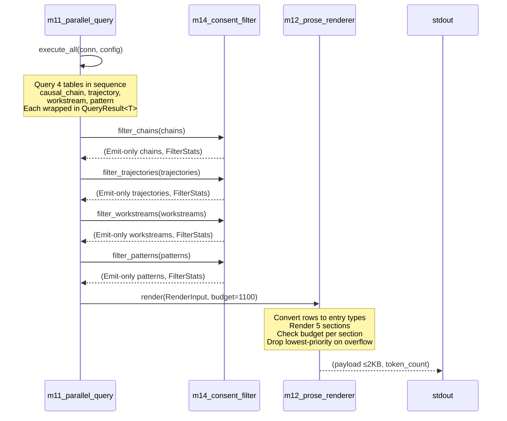
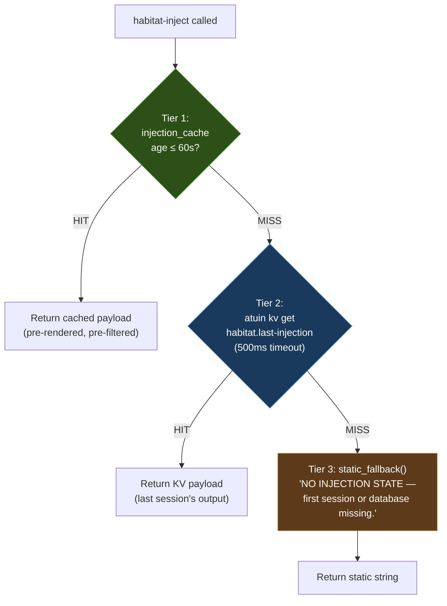

> Back to: [[HOME]] | [[Complete Wiring Schematic]] | [[L3 Injection Engine]] | [[README.md]](`~/claude-code-workspace/memory-injection/README.md`)
> POVM namespace: `habitat_injection_payload_*`

# Injection Payload Format — habitat-injection

> The <2KB prose payload injected at SessionStart. Token budget, section priorities,
> budget overflow handling, and the exact output format.
> Created: 2026-04-25 (S111 schematic pass)

---

## Payload Architecture



---

## Exact Output Format

```markdown
## Session S{NNN} Injection ({token_count} tokens)

### Orientation (≤80 tokens)
YOU WERE IN THE MIDDLE OF: {active workstream title}
Last session: {delta_summary from trajectory}
Fitness trending {UP|DOWN|FLAT}: {start:.3} → {end:.3} over {N} sessions

### Trajectory
S{N}: {fitness:.3} — {delta_summary}
S{N}: {fitness:.3} — {delta_summary}
S{N}: {fitness:.3} — {delta_summary}
S{N}: {fitness:.3} — {delta_summary}
S{N}: {fitness:.3} — {delta_summary}

### Workstreams
ACTIVE: {title} ({done}/{total}) — next: {resume_context}
BLOCKED: {title} — {blocker}
DEFERRED: {title} | {title}

### Unresolved Chains (by frequency)
{label} ({count}x) — {description}
{label} ({count}x) — {description}
{label} ({count}x) — {description}

### Health
All {N} services responding. Thermal {T:.3} ({class}).
```

---

## Token Counting

The `count_tokens()` function uses whitespace-split approximation:

```
count_tokens(text) = text.split_whitespace().count()
```

Each whitespace-delimited word or punctuation group = 1 token. This is a deliberate simplification — actual LLM tokenization varies, but whitespace-split provides a stable, fast, reproducible budget that tracks within ~20% of real token counts for prose.

---

## Section Budget Allocation

| Section | Budget | Priority | Content Source | Overflow |
|---------|--------|----------|----------------|----------|
| Orientation | 80 tokens | 1 (MANDATORY) | Latest trajectory + active workstream | Never dropped |
| Trajectory | 200 tokens | 2 | `session_trajectory` last 5 rows | Truncate rows |
| Workstreams | 300 tokens | 3 | `workstream` active + blocked + deferred | Truncate deferred |
| Chains | 200 tokens | 4 | `causal_chain` unresolved, by frequency DESC | Truncate tail |
| Health | 100 tokens | 5 | Service probe count + thermal | Dropped first |

### Overflow Strategy

When total exceeds 1100 tokens:
1. Drop **Health** section (save ~100 tokens)
2. Truncate **Chains** to 3 entries (save ~80 tokens)
3. Truncate **Workstreams** to active only (save ~100 tokens)
4. Truncate **Trajectory** to 3 rows (save ~80 tokens)
5. If Orientation alone exceeds budget: error (should never happen)

---

## Render Pipeline



---

## RenderInput Structure

```rust
struct RenderInput {
    session_number: u32,            // from config or atuin KV
    chains: Vec<ChainEntry>,        // label, count, description
    trajectory: Vec<TrajectoryEntry>, // session_id, fitness, delta_summary
    workstreams: WorkstreamSplit {
        active: Vec<WorkstreamEntry>,   // title, done, total, resume_context
        blocked: Vec<WorkstreamEntry>,  // title, blocker
        deferred: Vec<WorkstreamEntry>, // title only
    },
    patterns: Vec<PatternEntry>,    // pattern_id, weight, category, description
    services_healthy: u32,          // from health probe
    services_total: u32,            // typically 12
    thermal: Option<f64>,           // from SYNTHEX
}
```

---

## Fitness Trend Calculation

```
compute_fitness_trend(current, previous):
  if |current - previous| < 0.005:  "FLAT"
  elif current > previous:           "UP"
  else:                              "DOWN"
```

Epsilon of 0.005 prevents noise from appearing as trend changes.

---

## Concrete Example (Seeded Data)

```
## Session S110 Injection (287 tokens)

### Orientation (≤80 tokens)
YOU WERE IN THE MIDDLE OF: SpaceTimeDB injection.
Last session: fitness +0.010 after L8 sealed.
Fitness trending UP: 0.660 → 0.670 over 5 sessions.

### Trajectory
S106: 0.660 — L7+L8 sealed, daemon plan authored
S107: 0.662 — daemon wireup, 14 commits
S108: 0.669 — Watcher persona crystallised
S109: 0.668 — shadow daemon stabilised
S110: 0.670 — habitat-injection library complete

### Workstreams
ACTIVE: habitat-injection (0/11) — next: Build CLI binaries
ACTIVE: comms-v3 (10/16) — next: WS-6 habitat-wire
BLOCKED: WezTerm migration — apt unavailable
DEFERRED: BUG-055 systemd | BUG-058 Layers B+C

### Unresolved Chains (by frequency)
BUG-001-devenv-stop (12x) — devenv stop does not kill processes
trap-cp-alias (8x) — cp is aliased to interactive
trap-synthex-api-health (5x) — SYNTHEX health is /api/health NOT /health
BUG-034-povm-write-only (4x) — raw_http_post Ok(0) root
trap-stash-pop (3x) — stash pop on wrong stash

### Health
11/12 services responding. Thermal 0.550 (warm).
```

---

## Size Constraints

| Constraint | Value | Enforcement |
|-----------|-------|-------------|
| Token budget | 1100 | `count_tokens()` checked per section |
| Max payload bytes | 15,360 (15KB) | `InjectionConfig::max_payload_bytes` |
| Max injection latency | 100ms | `InjectionConfig::max_latency_ms` |
| Max chains injected | 5 | `InjectionConfig::max_chains` |
| Max patterns injected | 10 | `InjectionConfig::max_patterns` |
| Max trajectory points | 5 | `InjectionConfig::max_trajectory_points` |
| Max workstreams | 10 | `InjectionConfig::max_workstreams` |

---

## Three-Tier Fallback Integration



**Guarantee:** `execute_fallback_chain()` NEVER returns an error. NEVER panics. Always produces a non-empty payload. The binary exits 0 unconditionally.

---

## Cross-References

- **Renderer source:** `src/m3_injection/m12_prose_renderer.rs`
- **Fallback source:** `src/m3_injection/m13_fallback.rs`
- **Consent filter source:** `src/m3_injection/m14_consent_filter.rs`
- **Query executor source:** `src/m3_injection/m11_parallel_query.rs`
- **Complete Wiring:** [[Complete Wiring Schematic]]
- **Hebbian Learning:** [[Hebbian Learning]] | [[Hebbian Lifecycle Wiring]]
- **L3 Layer:** [[L3 Injection Engine]]
- **README:** [`README.md`](~/claude-code-workspace/memory-injection/README.md) — Quick Start, The One Query
- **POVM:** `habitat_injection_payload_*` namespace
