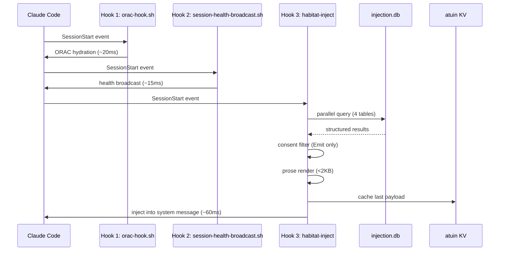

> Back to: [[HOME]] · [[MASTER INDEX]] · [[L3 Injection Engine]]

# Injection Pipeline

## SessionStart Hook Chain

## Latency Budget

```mermaid
gantt
    title Injection Latency Budget (<100ms)
    dateFormat X
    axisFormat %L ms

    section Queries
    causal_chain query    :0, 15
    trajectory query      :0, 10
    workstream query      :0, 10
    pattern query         :0, 15

    section Processing
    consent filter        :15, 25
    prose render          :25, 45
    token count           :45, 50

    section Output
    format payload        :50, 55
    write atuin cache     :55, 70
    stdout                :70, 75
```

## Fallback Tiers

See [[Three-Tier Fallback]] for the degradation chain when SQLite is unavailable.
