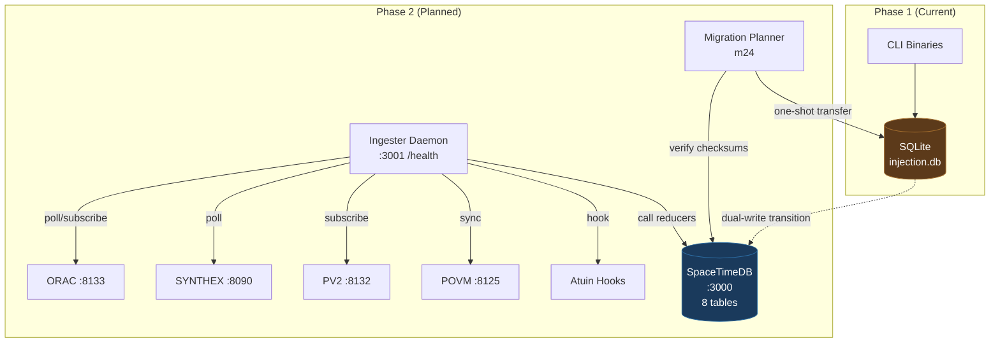
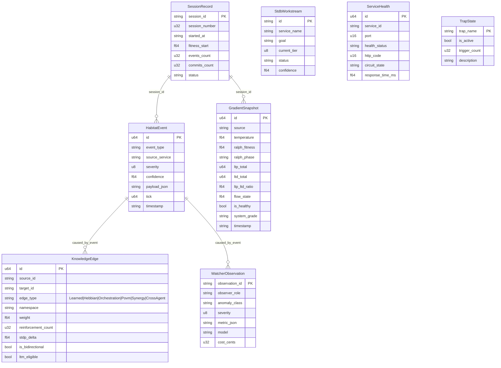
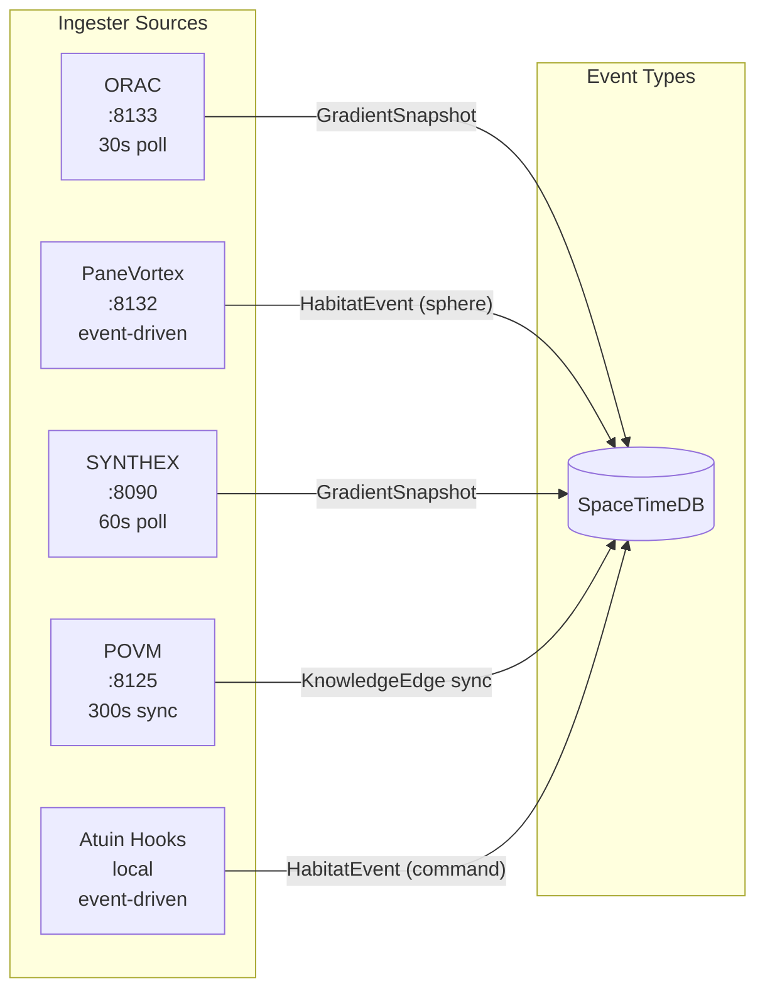
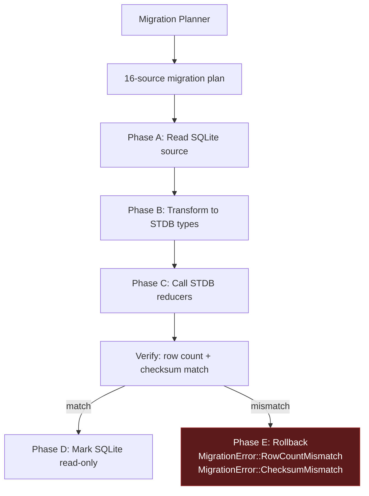

> Back to: [[HOME]] | [[Complete Wiring Schematic]] | [[L6 SpaceTimeDB Migration]] | [[SpaceTimeDB Plan]] | [[README.md]](`~/claude-code-workspace/memory-injection/README.md`)
> POVM namespace: `habitat_injection_stdb_*`

# SpaceTimeDB Phase 2 Wiring — habitat-injection

> 8 STDB table mirrors, 5 ingester sources, 11 reducers, 16-source migration planner.
> Feature-gated behind `stdb` + `ingester`. NOT shipped in Phase 1.
> Created: 2026-04-25 (S111 schematic pass)

---

## Phase 2 Architecture



---

## 8 STDB Table Mirrors



---

## 11 Reducer Signatures

| Reducer | Signature | Purpose |
|---------|-----------|---------|
| `IngestEvent` | `fn(HabitatEvent) -> Result<(), String>` | Ingest events from any source |
| `ReinforceEdge` | `fn(source_id, target_id, edge_type, namespace) -> Result<(), String>` | Hebbian edge reinforcement |
| `CaptureGradient` | `fn() -> Result<(), String>` | Snapshot all service metrics |
| `RegisterSession` | `fn(session_id, session_number, model) -> Result<(), String>` | Start a new session record |
| `CloseSession` | `fn(session_id) -> Result<(), String>` | End session, compute fitness delta |
| `RunDecay` | `fn() -> Result<(), String>` | Hebbian decay on all edges |
| `ForgetSphere` | `fn(sphere_id) -> Result<(), String>` | Consent-driven sphere removal |
| `CompactOldEvents` | `fn() -> Result<(), String>` | Retention: archive old events |
| `ConsolidateMatureEdges` | `fn() -> Result<(), String>` | LTM promotion for mature edges |
| `WatcherReinforce` | `fn(event_id) -> Result<(), String>` | Watcher-driven edge reinforcement |
| `WatcherAnnotateEvent` | `fn(event_id, anomaly_class, severity, classifier_output) -> Result<(), String>` | Watcher observation annotation |

---

## 5 Ingester Sources



### IngesterConfig

| Field | Default | Source |
|-------|---------|--------|
| `stdb_url` | `http://localhost:3000` | `services.stdb_port` |
| `health_port` | 3001 | `services.ingester_health_port` |
| `orac_url` | `http://localhost:8133` | hardcoded |
| `orac_poll_secs` | 30 | `services.orac_poll_secs` |
| `pv2_url` | `http://localhost:8132` | hardcoded |
| `synthex_url` | `http://localhost:8090` | hardcoded |
| `synthex_poll_secs` | 60 | `services.synthex_poll_secs` |
| `povm_url` | `http://localhost:8125` | hardcoded |
| `povm_sync_secs` | 300 | `services.povm_sync_secs` |

### SourceStatus (per-source health tracking)

```rust
struct SourceStatus {
    source: IngesterSource,
    healthy: bool,
    last_poll: Option<String>,
    events_ingested: u64,
    errors: u64,
    last_error: Option<String>,
}
```

---

## Migration Pipeline (m24)



### Migration Error Types

| Error | Fields | Meaning |
|-------|--------|---------|
| `ConnectionFailed` | endpoint, reason | Can't reach STDB or SQLite |
| `SourceReadFailed` | origin, reason | Can't read source data |
| `RowCountMismatch` | table, source_count, target_count | Data loss during transfer |
| `ChecksumMismatch` | table, source_sum, target_sum | Data corruption |
| `DualWriteTransitionFailed` | reason | Couldn't switch to dual-write mode |
| `ReducerFailed` | reducer, reason | STDB reducer call failed |

---

## Feature Gate Activation Path

```
Phase 1 (default):  sqlite + cli
                     ↓
Phase 2a:           + stdb         (STDB table types available)
                     ↓
Phase 2b:           + ingester     (full daemon with 5 sources)
                     ↓
Phase 2c:           + watcher-digest (Watcher-curated tables)
                     ↓
Phase 3a:           + inhibition    (inhibitory learning edges)
Phase 3b:           + substrate-reciprocal (autonomy scoring HTTP)
                     ↓
Full:               all features enabled
```

**Kill criteria (from plan.toml):** 20 sessions without measurable improvement in injection quality → revert to SQLite-only, remove STDB dependency.

---

## Enum Wiring (m22 enums)

| Enum | Variants | Used By |
|------|----------|---------|
| `EdgeType` | Learned, Hebbian, Orchestration, Povm, Synergy, CrossAgent | `KnowledgeEdge.edge_type` |
| `EventCategory` | Emergence, Sphere, Thermal, Command, Watcher, Session, Service, Hebbian, Other | Event classification |
| `ConsentState` | Emit, Store, Forget | Maps from L1 `ConsentLevel` |

---

## Cross-References

- **Phase 2 Vault:** `memory-injection-vault/HOME.md` — 46 notes, 24 Mermaid diagrams
- **Complete Wiring:** [[Complete Wiring Schematic]]
- **L6 Layer:** [[L6 SpaceTimeDB Migration]]
- **m22 source:** `src/m6_stdb/m22_stdb_module/` (tables.rs, enums.rs, reducers.rs, validation.rs)
- **m23 source:** `src/m6_stdb/m23_ingester.rs`
- **m24 source:** `src/m6_stdb/m24_migration.rs`
- **README:** [`README.md`](~/claude-code-workspace/memory-injection/README.md) — Phase 2 context
- **POVM:** `habitat_injection_stdb_*` namespace
- **Deliberation:** [[DELIBERATION_PLAN]] — Principle 6: "earn your database"
