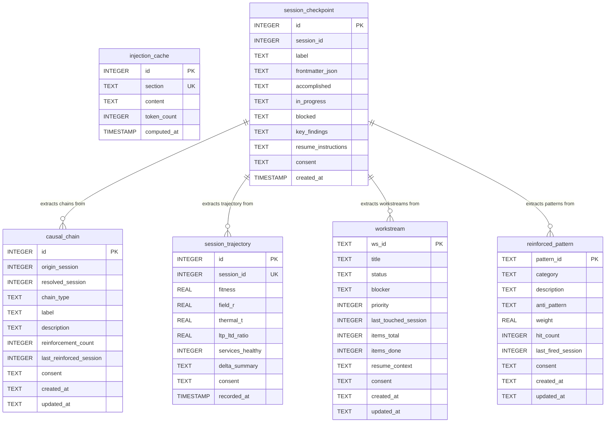

> Back to: [[HOME]] · [[MASTER INDEX]]

# Schema Diagram

## Entity Relationships

## Table Purposes

| Table | Rows (estimated) | Write Frequency | Read Frequency |
|-------|-----------------|----------------|----------------|
| `causal_chain` | ~50-200 | Per consolidation | Per injection |
| `session_trajectory` | ~1 per session | Per consolidation | Per injection |
| `workstream` | ~5-20 active | Per consolidation | Per injection |
| `reinforced_pattern` | ~50-200 | Per consolidation | Per injection |
| `injection_cache` | 5 (one per section) | Per consolidation | Per injection |
| `session_checkpoint` | ~1 per session | Per consolidation | On-demand query |

## DB Location

`~/.local/share/habitat/injection.db`
