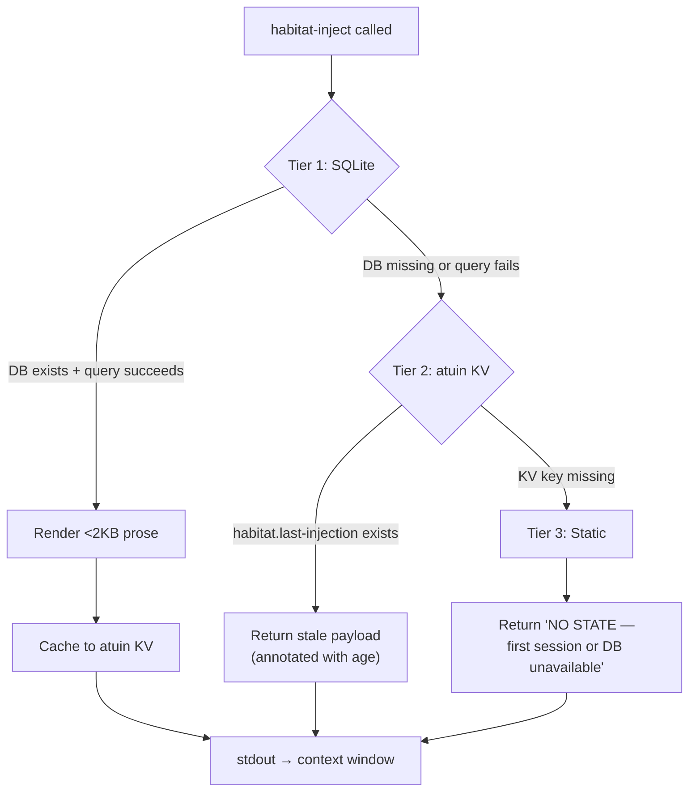

> Back to: [[HOME]] · [[MASTER INDEX]] · [[L3 Injection Engine]]

# Three-Tier Fallback

## Design

The injection pipeline never fails. If the primary path (SQLite) is unavailable, it degrades through two fallback tiers.



## Tier Details

| Tier | Source | Latency | Freshness | When Used |
|------|--------|---------|-----------|-----------|
| 1 | SQLite `injection.db` | ~60ms | Current session | Normal operation |
| 2 | atuin KV `habitat.last-injection` | ~10ms | Last successful injection | DB corruption, migration, disk full |
| 3 | Static string | ~0ms | None | First ever session, all substrates unavailable |

## Staleness Annotation

Tier 2 payloads include a staleness annotation:
```
[stale: last injected 3 sessions ago, 2026-04-24T10:30:00Z]
```

This tells Claude that the data is not current and should be treated as approximate.
