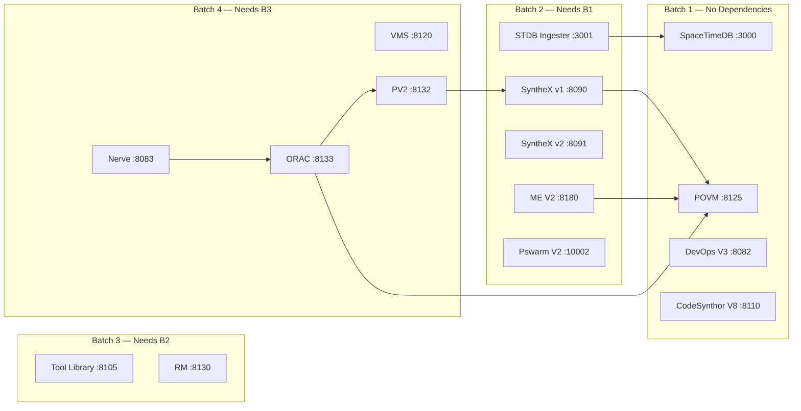

> Back to: [[HOME]] · [[System Topology]]

# Batch Ordering — devenv Start Sequence

**STDB is Batch 1** — it has no dependencies and must be available before the ingester (Batch 2) starts polling.

**Ingester is Batch 2** — depends only on STDB. It starts polling ORAC/PV2/SYNTHEX as soon as they're up (circuit breaker pattern for services not yet started).

---

See: [[System Topology]] · [[Sidecar Architecture]]
