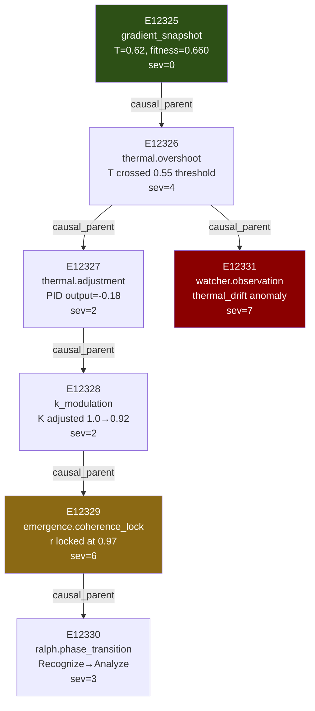
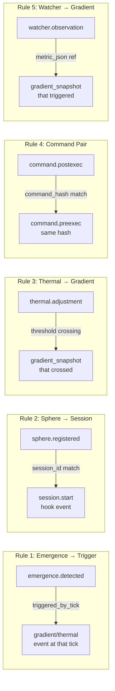

> Back to: [[HOME]] · [[T1 — HabitatEvent]] · [[DEPLOYMENT FRAMEWORK]]

# Causal Chain Architecture

The key differentiator. Every [[T1 — HabitatEvent]] carries `causal_parent: Option<u64>` linking effect to cause.

## Causal Chain Example



## The 5 Causal Linkage Rules



## Query Patterns for Causal Investigation

### Walk chain forward (effects of event X)
```sql
-- All events caused by event 12325
SELECT id, event_type, severity, timestamp
FROM habitat_event
WHERE causal_parent = 12325
ORDER BY timestamp;
```

### Walk chain backward (root cause of event X)
```sql
-- Recursive walk to root cause
WITH RECURSIVE chain AS (
  SELECT * FROM habitat_event WHERE id = 12331
  UNION ALL
  SELECT e.* FROM habitat_event e
  JOIN chain c ON e.id = c.causal_parent
)
SELECT id, event_type, severity, timestamp FROM chain
ORDER BY timestamp;
```

### Find unlinked high-severity events (orphan anomalies)
```sql
SELECT id, event_type, severity, source_service, timestamp
FROM habitat_event
WHERE severity >= 5
AND causal_parent IS NULL
ORDER BY timestamp DESC LIMIT 20;
```

### TC8 Cross-Substrate Investigation
```bash
# Step 1: Find the fitness drop in STDB
spacetime sql habitat \
  "SELECT id, ralph_fitness, timestamp FROM gradient_snapshot
   WHERE ralph_fitness < 0.66 ORDER BY timestamp DESC LIMIT 1"

# Step 2: Find events around that timestamp
spacetime sql habitat \
  "SELECT id, event_type, severity, causal_parent
   FROM habitat_event
   WHERE timestamp BETWEEN '2026-04-19T10:25:00' AND '2026-04-19T10:35:00'
   AND severity >= 3 ORDER BY timestamp"

# Step 3: What commands were running? (Atuin)
atuin search --after "2026-04-19T10:25:00" --before "2026-04-19T10:35:00"

# Step 4: ORAC's current emergence view
curl -s localhost:8133/emergence | python3 -c \
  "import json,sys; d=json.load(sys.stdin); [print(f'{k}: {v}') for k,v in d.get('by_type',{}).items()]"
```

## ORAC Patch Required (C4)

ORAC's emergence detector must emit `triggered_by_tick` in event payloads:

```rust
// In orac-sidecar/src/m4_emergence/m37_emergence_detector.rs
// EXISTING: EmergenceEvent { detector_id, event_type, confidence, ... }
// ADD: triggered_by_tick: u64  (~5 LOC)
```

Without this, Rule 1 linkage has no source data. This is the **C4 critical gap** — the chain's most important link.

---

See: [[Gap Analysis — Conventional]] · [[T1 — HabitatEvent]] · [[Phase C — Watcher + Causal Chains]]
