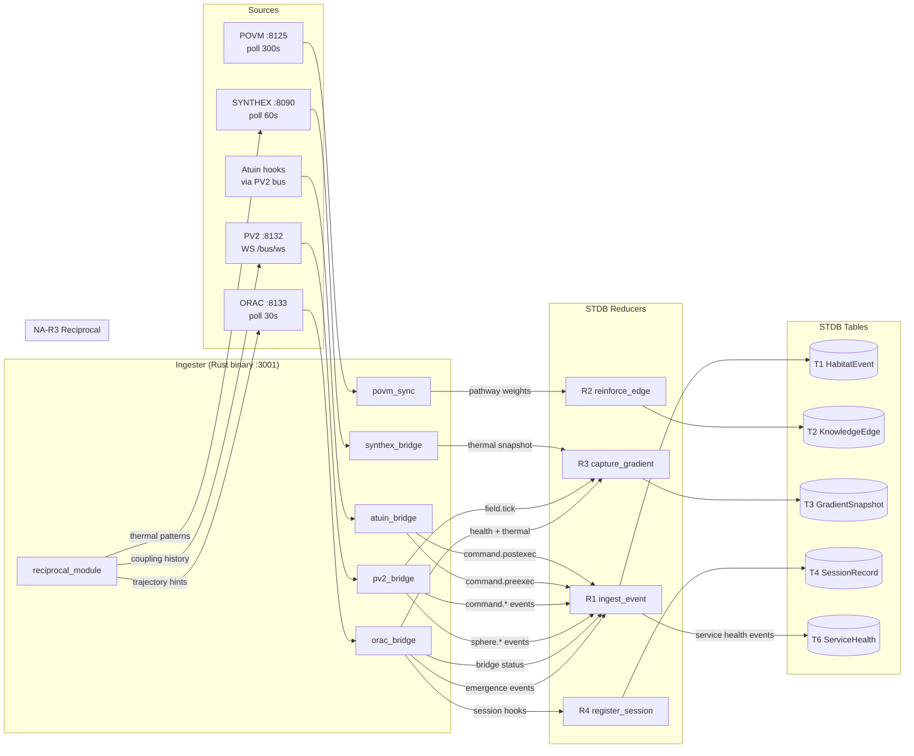
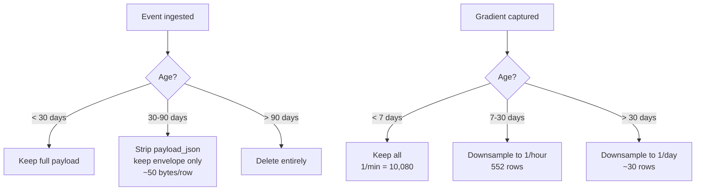

> Back to: [[HOME]] · [[Ingester Pipeline]] · [[System Topology]]

# Data Flow — Continuous Ingestion

## Ingester Source → Reducer → Table Mapping

## Event Rate Projections

| Source | Events/min | Events/day | Primary Table |
|--------|-----------|------------|---------------|
| ORAC /health poll | 2 | 2,880 | T3 + T6 |
| ORAC /emergence poll | 2 | 2,880 | T1 |
| PV2 /bus/ws stream | ~5 | 7,200 | T1 |
| SYNTHEX /v3/thermal | 1 | 1,440 | T3 |
| POVM /pathways sync | 0.003 | ~5 | T2 |
| Atuin command events | ~10 | 14,400 | T1 |
| **Total** | **~20** | **~28,800** | |

## Retention Policy (R7)

**30-day memory footprint:**
- Events: 28,800/day × 30 × 500 bytes = ~415 MB (pre-compaction)
- After R7 compaction: ~170 MB (envelope-only for days 1-30 + full for last 7)
- Gradients: 10,080 + 552 hourly + 30 daily = ~11K rows × 300 bytes = ~3 MB
- **Total steady-state: ~200 MB** — well within 1 GB limit

---

See: [[Reducers]] · [[T1 — HabitatEvent]] · [[T3 — GradientSnapshot]]
