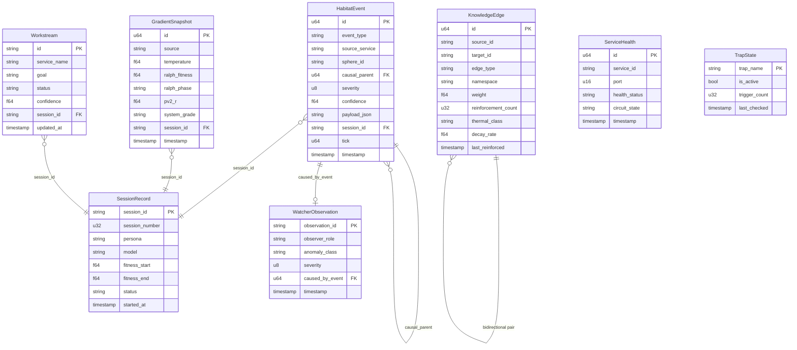

> Back to: [[HOME]] · [[MASTER INDEX]]

# Entity Relationship Diagram

## STDB Table Relationships

## Key Relationships

| From | To | Cardinality | Link Field |
|------|----|-------------|------------|
| HabitatEvent | HabitatEvent | Self-referential (causal chain) | `causal_parent → id` |
| HabitatEvent | SessionRecord | Many-to-one | `session_id` |
| WatcherObservation | HabitatEvent | Many-to-one | `caused_by_event → id` |
| GradientSnapshot | SessionRecord | Many-to-one | `session_id` |
| Workstream | SessionRecord | Many-to-one | `session_id` |

## Table Independence

- **TrapState** and **ServiceHealth** are independent — no foreign keys to other tables
- **KnowledgeEdge** is self-contained — source_id/target_id are free-text identifiers, not FK references
- **SessionRecord** is the temporal anchor — most tables reference it via `session_id`

---

See: [[T1 — HabitatEvent]] · [[T4 — SessionRecord]] · [[T8 — WatcherObservation]]
