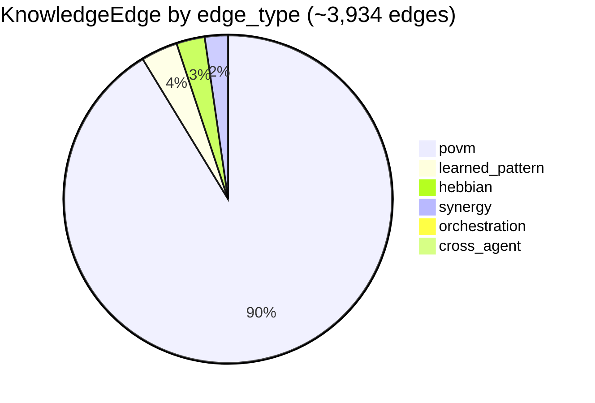
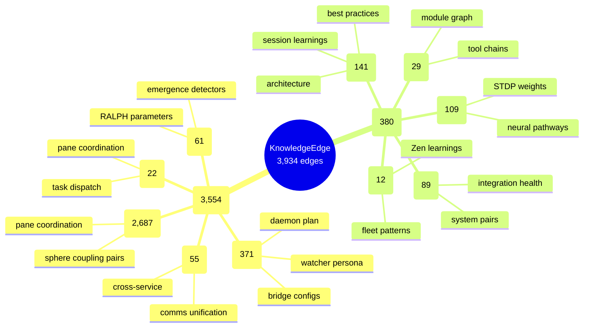
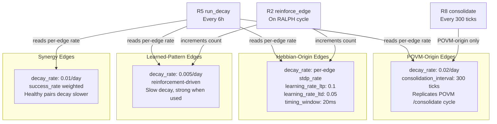

> Back to: [[HOME]] · [[T2 — KnowledgeEdge]] · [[Migration Strategy]]

# Knowledge Graph Structure

## Edge Type Distribution (Post-Migration)

## Namespace Clusters

## Learning Dynamics (NA-R1 Per-Edge)

## Thermal Classification View

Derived from the `v3_pattern_view` pattern in the existing `hebbian_pulse.db`:

| thermal_class | Weight Range | Meaning | Decay Behaviour |
|--------------|-------------|---------|-----------------|
| `critical` | > 0.9 | Core system pathway | Decay suspended |
| `hot` | 0.7 - 0.9 | Actively reinforced | Normal decay |
| `warm` | 0.5 - 0.7 | Moderate use | Normal decay |
| `cool` | 0.3 - 0.5 | Fading | Accelerated decay |
| `cold` | < 0.3 | Candidate for pruning | Pruned if < 0.05 |

---

See: [[T2 — KnowledgeEdge]] · [[Reducers]] · [[Gap Analysis — Non-Anthropocentric]]
