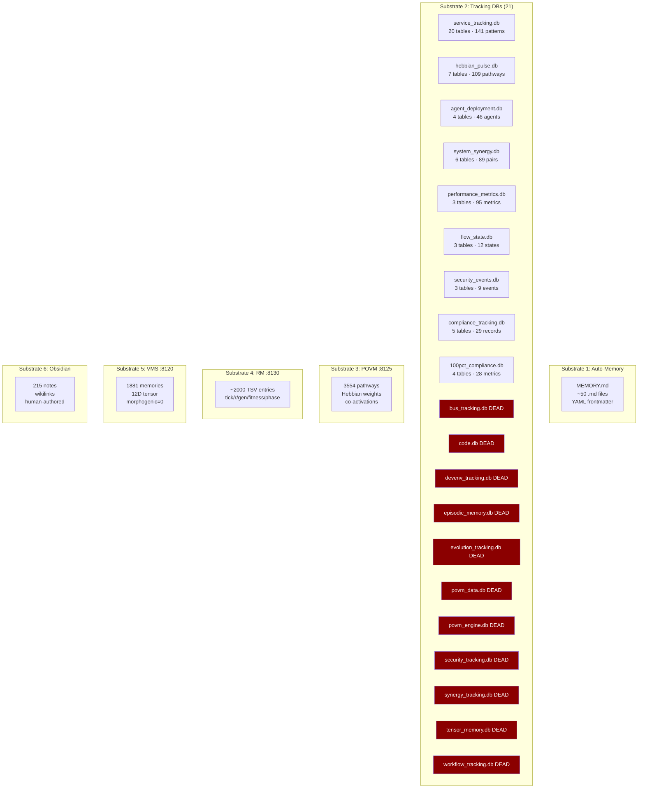
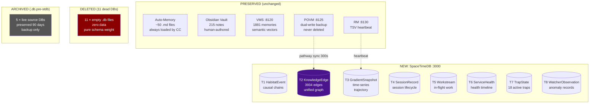

> Back to: [[HOME]] · [[Current State — Memory Substrates]] · [[What Replaces vs Preserves]]

# Memory Consolidation Map

## Before STDB (6 substrates, 21 DBs, fragmented)

## After STDB (consolidated + preserved)

## Net Change

| Metric | Before | After | Delta |
|--------|--------|-------|-------|
| Active databases | 21 SQLite + 4 HTTP | 1 STDB + 4 HTTP | -20 DBs |
| Dead databases | 11 | 0 | -11 |
| Query tools needed | sqlite3, curl, atuin kv, grep, Read | spacetime sql (primary) | -4 tools |
| Bootstrap layers | 7 (L0-L6) | 11 (L0-L10) | +4 layers |
| Bootstrap latency | 55ms | <100ms | +45ms (for 4× more data) |
| Bootstrap data | 9 KB | 15 KB | +6 KB |
| Pattern reinforcement | Write-only (1/141 reinforced) | Live reinforce_edge on RALPH cycle | Fixed |
| Causal queries | Impossible | Recursive chain traversal | New capability |
| Trajectory | Manual session note reading | Last 5 snapshots with delta | New capability |
| Workstream visibility | Parse CLAUDE.local.md | SQL query on T5 | New capability |

---

See: [[Executive Summary]] · [[Migration Strategy]] · [[Bootstrap Chain — Current vs Target]]
