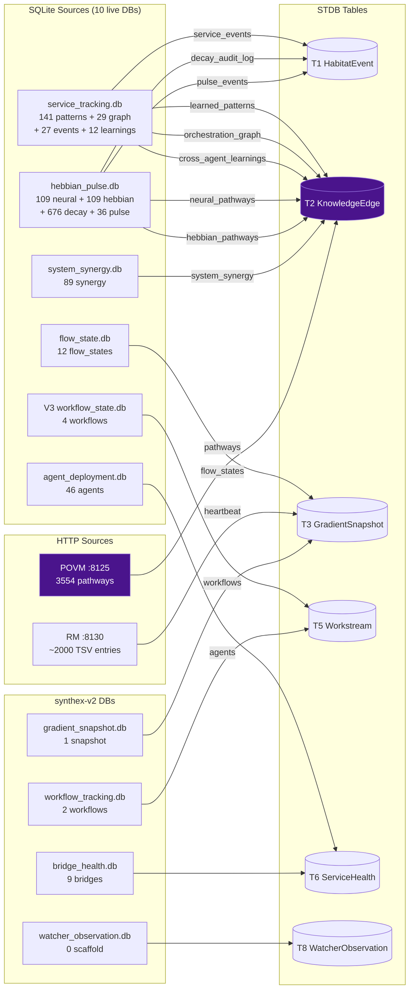
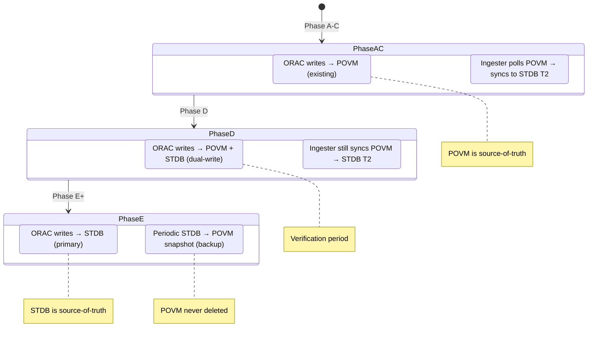
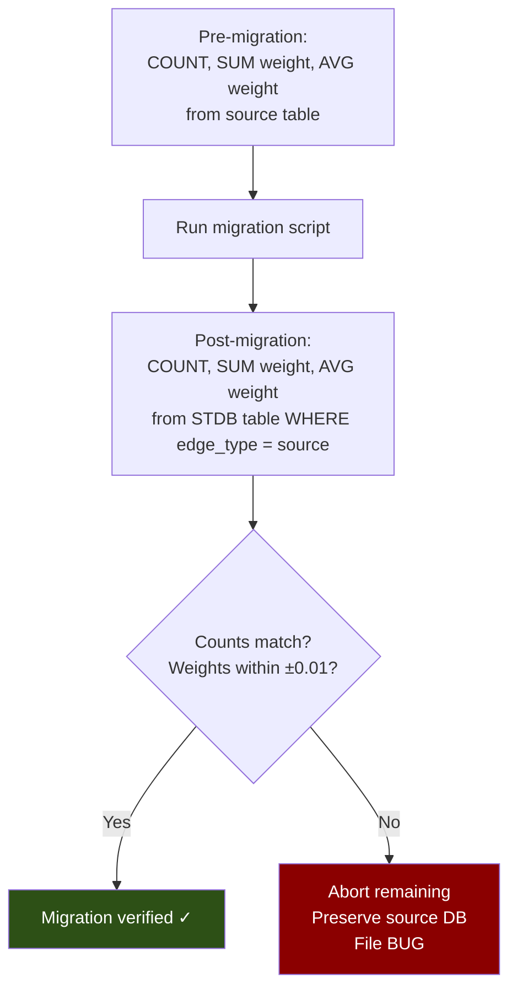
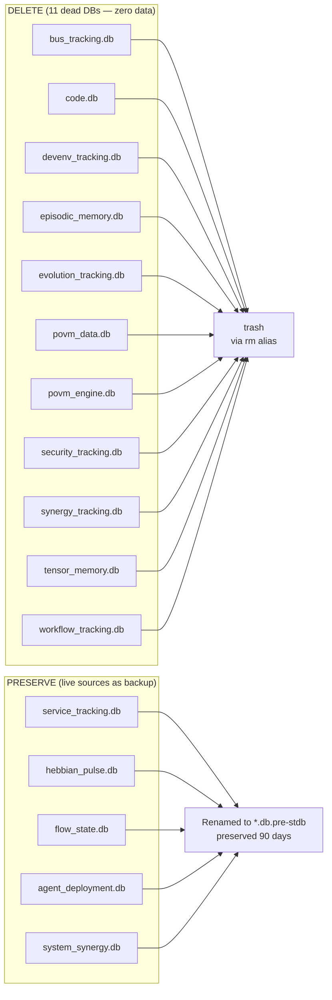

> Back to: [[HOME]] · [[Migration Strategy]] · [[Phase B — Knowledge Graph Migration]]

# Migration Flow

## Source → STDB Table Mapping

## POVM Dual-Write Transition

## Verification Checksum Process

## Dead DB Cleanup (Phase E)

---

See: [[Migration Strategy]] · [[Phase B — Knowledge Graph Migration]] · [[Phase E — Bootstrap Revolution]]
