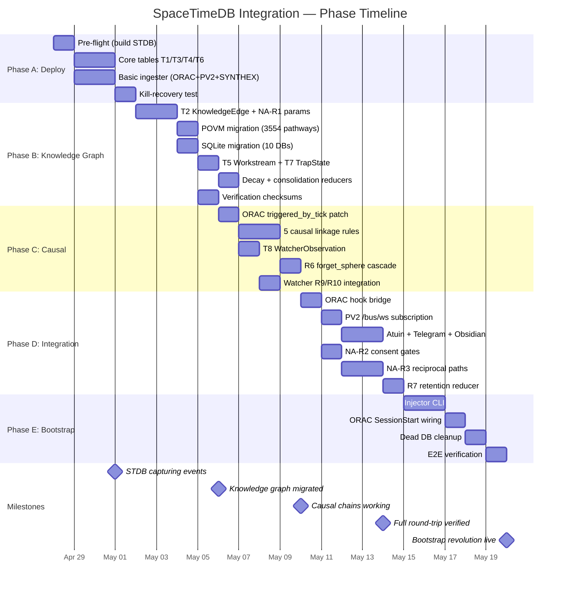
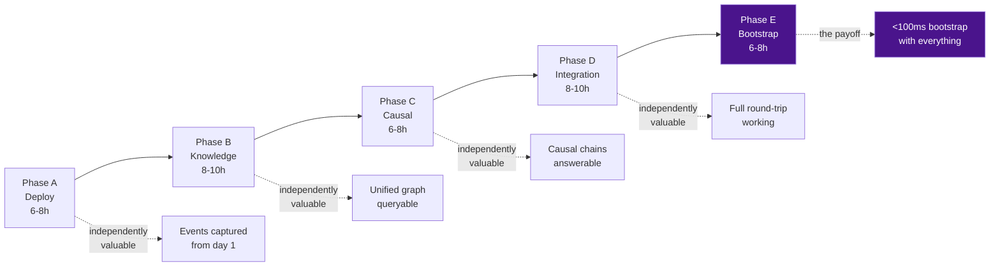

> Back to: [[HOME]] · [[Session Estimates]] · [[MASTER INDEX]]

# Phase Timeline

## Gantt Chart

## Critical Path

Each phase is independently valuable. You don't need Phase E to benefit from Phase A's event capture. But Phase E is where the full vision lands.

---

See: [[Phase A — STDB Deploy]] · [[Phase E — Bootstrap Revolution]] · [[Session Estimates]]
