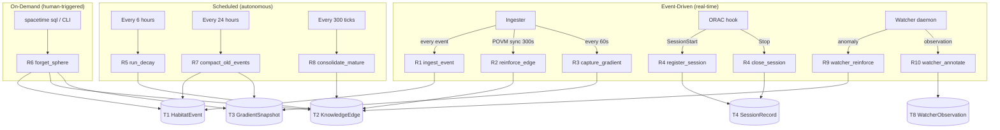

> Back to: [[HOME]] · [[Reducers]]

# Reducer Lifecycle — When Each Fires

## Trigger Sources

## Scheduled Reducer Cadence

```mermaid
gantt
    title Reducer Firing Pattern (24-hour window)
    dateFormat HH:mm
    axisFormat %H:%M

    section R3 capture_gradient
    Capture  :r3a, 00:00, 1m
    Capture  :r3b, 00:01, 1m
    ...1440 per day  :r3c, 00:02, 1m

    section R5 run_decay
    Decay cycle 1  :r5a, 00:00, 5m
    Decay cycle 2  :r5b, 06:00, 5m
    Decay cycle 3  :r5c, 12:00, 5m
    Decay cycle 4  :r5d, 18:00, 5m

    section R7 compact_old_events
    Compaction run  :r7a, 03:00, 15m

    section R8 consolidate
    Consolidate (300-tick intervals, ~4× per hour)  :r8a, 00:00, 2m
    ...96 per day  :r8b, 00:15, 2m
```

## Reducer Conflict Matrix

| Reducer | Reads | Writes | Can Conflict With |
|---------|-------|--------|-------------------|
| R1 ingest | — | T1 | R7 (concurrent delete+insert) |
| R2 reinforce | T2 | T2 | R5 (decay vs reinforce race) |
| R3 capture | — | T3 | R7 (snapshot downsample) |
| R5 decay | T2 | T2 | R2, R9 (concurrent weight change) |
| R6 forget | T1,T2,T3 | T1,T2,T3 | All (mass delete) |
| R7 compact | T1,T3 | T1,T3 | R1, R3 (concurrent insert+delete) |

**STDB guarantees:** All reducers run in transactions. Conflicts are resolved by STDB's MVCC — concurrent reducers see consistent snapshots. No application-level locking needed.

---

See: [[Reducers]] · [[Data Flow — Ingestion]]
