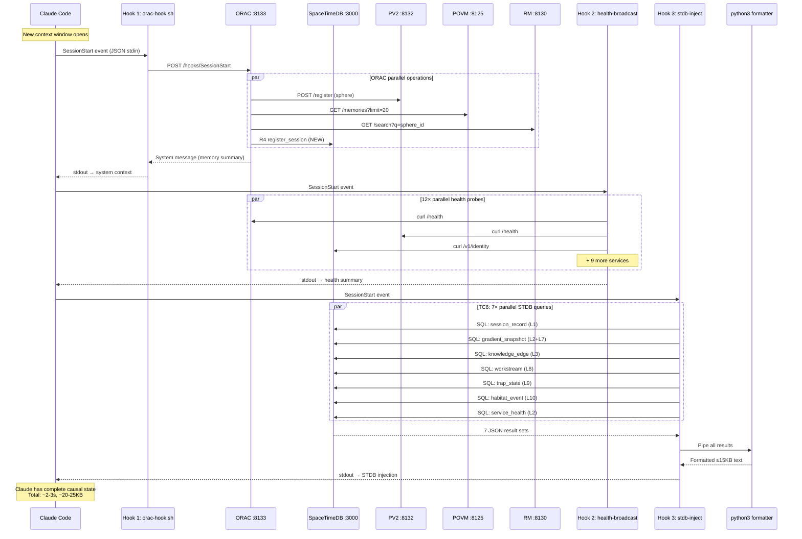

> Back to: [[HOME]] · [[DEPLOYMENT FRAMEWORK]] · [[Injector — Context Window Bootstrap]]

# SessionStart Injection Sequence

## Complete Sequence Diagram

## Latency Breakdown

```mermaid
gantt
    title SessionStart Hook Chain Timeline
    dateFormat X
    axisFormat %Lms

    section Hook 1: ORAC
    POST /hooks/SessionStart    :h1, 0, 800
    ORAC sphere register        :h1a, 100, 300
    ORAC POVM hydrate           :h1b, 100, 500
    ORAC RM hydrate             :h1c, 100, 400
    ORAC STDB register_session  :h1d, 100, 200
    Format response             :h1e, 600, 800

    section Hook 2: Health
    12× parallel curl           :h2, 800, 1400
    Atuin KV write              :h2a, 1400, 1500

    section Hook 3: STDB Inject
    7× spacetime sql (parallel) :h3, 1500, 1560
    python3 format              :h3a, 1560, 1580
    stdout write                :h3b, 1580, 1585

    section Total
    Claude ready                :milestone, 1585, 1585
```

**Typical total: ~1.6s.** Worst case (cold services, STDB WAL replay): ~5s. Timeout ceiling: 13s (6+4+3).

---

See: [[DEPLOYMENT FRAMEWORK]] · [[Injector — Context Window Bootstrap]]
