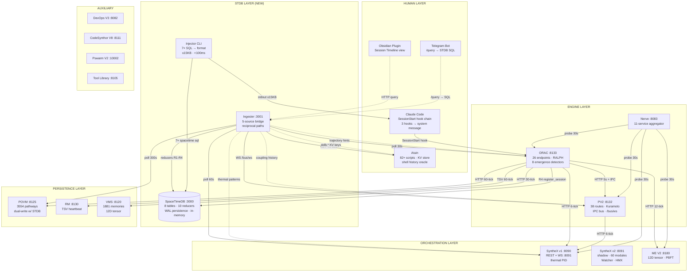

> Back to: [[HOME]] · [[MASTER INDEX]] · [[DEPLOYMENT FRAMEWORK]]

# System Topology — Complete Service Wiring

## Full Habitat + STDB Topology

## Port Map (Post-STDB)

| Port | Service | Batch | Role |
|------|---------|-------|------|
| `:3000` | **SpaceTimeDB** | **1** | **Causal memory substrate** |
| `:3001` | **STDB Ingester** | **2** | **Multi-source bridge** |
| `:8082` | DevOps V3 | 1 | Neural orchestration |
| `:8083` | Nerve Center | 4 | 11-service aggregator |
| `:8090` | SyntheX v1 | 2 | REST + thermal PID |
| `:8091` | SyntheX v2 shadow | 2 | 60 modules, Watcher |
| `:8105` | Tool Library | 3 | 65 tools |
| `:8110` | CodeSynthor V8 | 1 | Pattern library |
| `:8120` | VMS | 4 | Semantic memory |
| `:8125` | POVM | 1 | Hebbian pathways |
| `:8130` | RM | 3 | TSV persistence |
| `:8132` | Pane-Vortex | 4 | Kuramoto field |
| `:8133` | ORAC | 4 | RALPH + emergence |
| `:8180` | ME V2 | 2 | 12D fitness tensor |
| `:10002` | Pswarm V2 | 2 | 40 agents |

---

See: [[Sidecar Architecture]] · [[Ingester Pipeline]] · [[Batch Ordering]]
