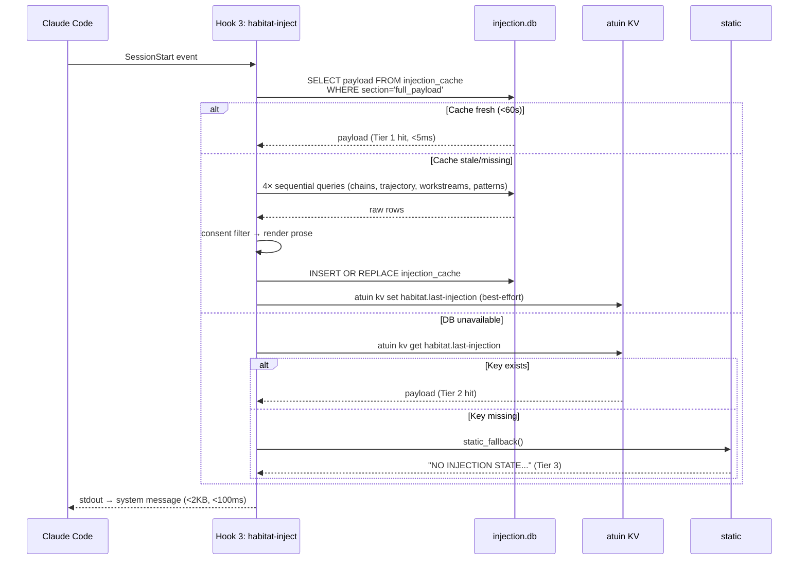
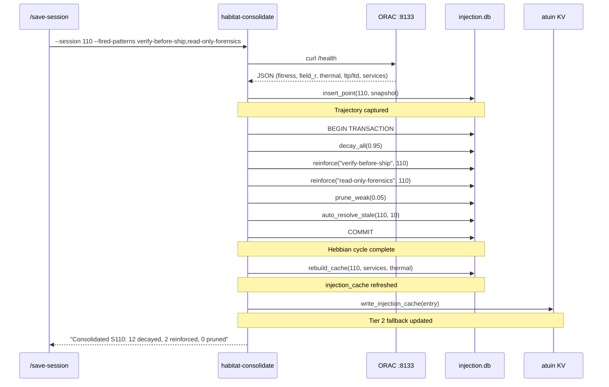
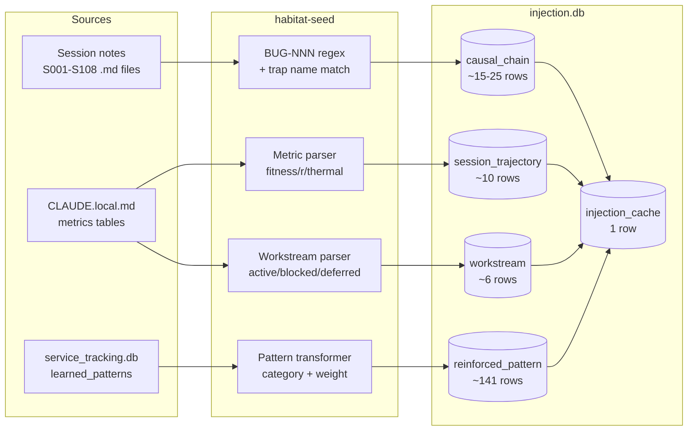

# CLI Binary Architecture

> Back to: [[EXECUTION_PLAN]] · [[DEPLOYMENT_FLOW]]

## Binary Dependency Graph

```mermaid
graph TD
    subgraph "CLI Binaries"
        INIT[habitat-init]
        INJECT[habitat-inject]
        CONSOL[habitat-consolidate]
        QUERY[habitat-query]
        SEED[habitat-seed]
    end

    subgraph "L1 Foundation"
        L1C[m03_config]
        L1T[m01_types]
        L1E[m02_errors]
        L1K[m05_constants]
    end

    subgraph "L2 Schema"
        L2S[m06_schema]
        L2CC[m07_causal_chain]
        L2TR[m08_trajectory]
        L2WS[m09_workstream]
        L2PA[m10_pattern]
        L2CP[m10b_checkpoint]
    end

    subgraph "L3 Injection"
        L3PQ[m11_parallel_query]
        L3PR[m12_prose_renderer]
        L3FB[m13_fallback]
        L3CF[m14_consent_filter]
    end

    subgraph "L4 Consolidation"
        L4CI[m15_checkpoint_ingest]
        L4TC[m15b_trajectory_capture]
        L4HE[m16_hebbian_engine]
        L4CB[m17_cache_builder]
        L4AC[m18_atuin_cache]
    end

    subgraph "L5 Query"
        L5PQ[m19_preset_queries]
        L5RQ[m20_raw_query]
        L5FZ[m21_fzf_browser]
        L5SC[m21b_scripts_engine]
    end

    INIT --> L1C
    INIT --> L2S

    INJECT --> L1C
    INJECT --> L2S
    INJECT --> L3PQ
    INJECT --> L3PR
    INJECT --> L3FB
    INJECT --> L3CF
    INJECT --> L4CB
    INJECT --> L4AC

    CONSOL --> L1C
    CONSOL --> L2S
    CONSOL --> L4CI
    CONSOL --> L4TC
    CONSOL --> L4HE
    CONSOL --> L4CB
    CONSOL --> L4AC

    QUERY --> L1C
    QUERY --> L2S
    QUERY --> L5PQ
    QUERY --> L5RQ
    QUERY --> L5FZ

    SEED --> L1C
    SEED --> L2S
    SEED --> L2CC
    SEED --> L2TR
    SEED --> L2WS
    SEED --> L2PA

    style INJECT fill:#2d5016,color:#fff
    style CONSOL fill:#8b6914,color:#fff
    style INIT fill:#1a3a5c,color:#fff
    style QUERY fill:#5c1a3a,color:#fff
```

## SessionStart Injection Flow

## Post-Session Consolidation Flow

## Data Seeding Pipeline

---

*Back to: [[EXECUTION_PLAN]] · [[DEPLOYMENT_FLOW]] · [[HOME]]*
