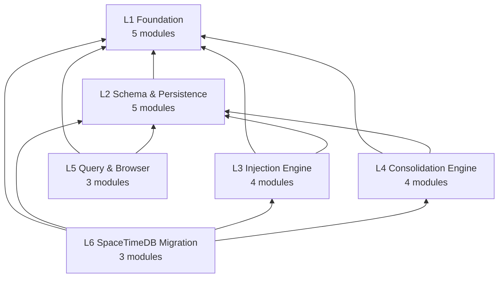

# habitat-injection — Layer Dependencies

```mermaid
graph BT
    L1[L1 Foundation<br/>5 modules]
    L2[L2 Schema & Persistence<br/>5 modules]
    L3[L3 Injection Engine<br/>4 modules]
    L4[L4 Consolidation Engine<br/>4 modules]
    L5[L5 Query & Browser<br/>3 modules]
    L6[L6 SpaceTimeDB Migration<br/>3 modules]

    L2 --> L1
    L3 --> L1
    L3 --> L2
    L4 --> L1
    L4 --> L2
    L5 --> L1
    L5 --> L2
    L6 --> L1
    L6 --> L2
    L6 --> L3
    L6 --> L4
```
